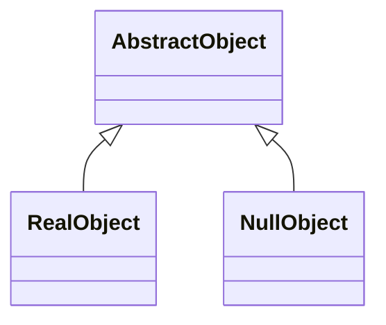

# Null Object
> Version: dp_20231231_202019

- [Builder Design Pattern](#builder-design-pattern)
   * [Summary](#summary)
      + [Essence](#essence)
      + [Real examples](#real-examples)
   * [Implementation](#implementation)
      + [How to use it?](#how-to-use-it)
      + [Python code examples:](#python-code-examples)
   * [Analysis](#analysis)
      + [Cleaner Code?](#cleaner-code)
      + [Readable Code?](#readable-code)
      + [Replaceable code?](#replaceable-code)
      + [Testable code?](#testable-code)
      + [Advantages?](#advantages)
      + [Disadvantages?](#disadvantages)
   * [Remarks](#remarks)
      + [Concerns and Tips?](#concerns-and-tips)
      + [Execrises](#execrises)

## Summary

### Essence
The Null Object design pattern provides a default behavior for null references, avoiding null pointer exceptions. It eliminates the need for null checks and reduces the risk of null pointer exceptions. The null object implements the same interface as the original class, providing default implementations for the methods. The null object can be used in place of null references, ensuring that the code can always call methods on the object without errors. The Null Object design pattern promotes clean code, readability, loose coupling, and ease of testing.

### Real examples

- Handling optional dependencies in a dependency injection framework.
- Providing default behavior for optional features in a software system.
- Avoiding null pointer exceptions in method calls.




## Implementation
### How to use it?
To use the Null Object design pattern, follow these steps:
1. Create an abstract class or interface that defines the common methods.
2. Create a concrete class that implements the abstract class or interface.
3. Create a null object class that also implements the abstract class or interface, providing default implementations for the methods.
4. Replace null references with instances of the null object class.

### Python code examples:
```python
class AbstractObject:
    def do_something(self):
        raise NotImplementedError()


class RealObject(AbstractObject):
    def do_something(self):
        print('Doing something...')


class NullObject(AbstractObject):
    def do_something(self):
        pass


# Usage
obj = RealObject()
obj.do_something()

null_obj = NullObject()
null_obj.do_something()
```
The code defines an abstract class 'AbstractObject' with a method 'do_something'. 'RealObject' and 'NullObject' are concrete classes that implement the 'do_something' method. 'RealObject' performs the actual action, while 'NullObject' does nothing. The code demonstrates the usage of both objects.   


## Analysis
### Cleaner Code?
The Null Object design pattern eliminates the need for null checks throughout the code, making it more readable and reducing the risk of null pointer exceptions.

### Readable Code?
By using the Null Object design pattern, the code becomes more readable as it avoids the clutter of null checks. The default behavior provided by the null object makes the code easier to understand and follow.

### Replaceable code?
The Null Object design pattern helps in making components loosely coupled by providing a default implementation that can be used in place of null references. This allows the code to depend on abstractions rather than concrete implementations, promoting loose coupling.

### Testable code?
The Null Object design pattern makes the code easy to be tested as it eliminates the need for mocking or handling null references in test cases. The null object can be used as a default dependency, simplifying the testing process.

### Advantages?

- Avoids null pointer exceptions by providing a default behavior for null references.
- Simplifies code by eliminating the need for null checks.
- Improves readability by providing a clear default behavior.
- Makes code easy to be tested by eliminating the need for mocking or handling null references in test cases.
- Promotes loose coupling by depending on abstractions rather than concrete implementations.

### Disadvantages?

- May introduce additional complexity if the null object needs to be customized for different scenarios.
- Requires careful design to ensure that the null object behaves correctly in all situations.
- Can potentially hide bugs if the null object is used incorrectly or if the default behavior is not appropriate.


## Remarks
### Concerns and Tips?

- One concern with the Null Object design pattern is that it may introduce additional complexity if the null object needs to be customized for different scenarios. Careful design and consideration are required to ensure that the null object behaves correctly in all situations.
- Programming tips:
1. Use the Null Object design pattern when dealing with null references that can cause null pointer exceptions.
2. Design the null object to provide a default behavior that is appropriate for the context.
3. Ensure that the null object implements the same interface as the original class to maintain compatibility.
4. Use the null object in place of null references to avoid null checks and simplify the code.
5. Test the code with both null and non-null references to ensure the null object behaves correctly.
- One tricky point to consider when using the Null Object design pattern is to ensure that the default behavior provided by the null object is appropriate for the context. It should not introduce unexpected side effects or hide bugs in the code.


### Execrises

- Q: What is the purpose of the Null Object design pattern?

  - A: The purpose of the Null Object design pattern is to provide a default behavior for null references, avoiding null pointer exceptions.

Q: How does the Null Object design pattern help in making the code clean?

  - A: The Null Object design pattern eliminates the need for null checks, simplifying the code and making it more readable.

Q: How does the Null Object design pattern promote loose coupling?

  - A: The Null Object design pattern allows the code to depend on abstractions rather than concrete implementations, making the components loosely coupled.

