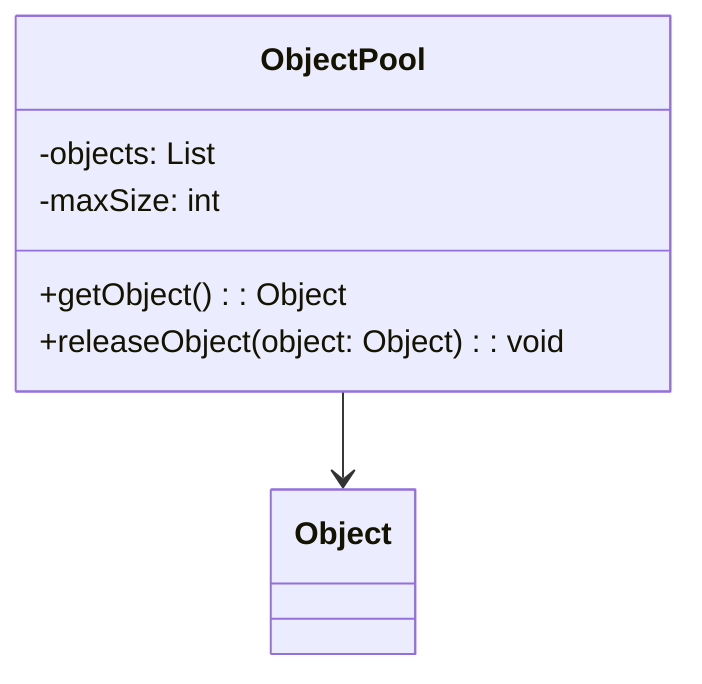

# Object Pool
> Version: dp_20231231_202019

- [Builder Design Pattern](#builder-design-pattern)
   * [Summary](#summary)
      + [Essence](#essence)
      + [Real examples](#real-examples)
   * [Implementation](#implementation)
      + [How to use it?](#how-to-use-it)
      + [Python code examples:](#python-code-examples)
   * [Analysis](#analysis)
      + [Cleaner Code?](#cleaner-code)
      + [Readable Code?](#readable-code)
      + [Replaceable code?](#replaceable-code)
      + [Testable code?](#testable-code)
      + [Advantages?](#advantages)
      + [Disadvantages?](#disadvantages)
   * [Remarks](#remarks)
      + [Concerns and Tips?](#concerns-and-tips)
      + [Execrises](#execrises)

## Summary

### Essence
The Object Pool design pattern improves performance and resource utilization by reusing pre-initialized objects instead of creating new ones. It encapsulates the object creation and reuse logic in a separate class, promoting loose coupling and code modularity.

### Real examples

- When creating and initializing objects is expensive.
- When objects are frequently created and destroyed.
- When there is a limited number of resources available.




## Implementation
### How to use it?
To use the Object Pool design pattern, follow these steps:
1. Create a pool of objects and initialize them.
2. When an object is needed, check if there is an available object in the pool.
3. If there is an available object, use it. Otherwise, create a new object.
4. After using the object, release it back to the pool.

### Python code examples:
```python
import threading

class ObjectPool:
    def __init__(self, max_size):
        self.objects = []
        self.max_size = max_size
        self.lock = threading.Lock()

    def get_object(self):
        with self.lock:
            if len(self.objects) > 0:
                return self.objects.pop()
            else:
                return Object()

    def release_object(self, obj):
        with self.lock:
            if len(self.objects) < self.max_size:
                self.objects.append(obj)

class Object:
    pass
```
   


## Analysis
### Cleaner Code?
Reduces the number of object creations and destructions, resulting in cleaner code.

### Readable Code?
Encapsulates object creation and reuse logic in a separate class, making the code easier to understand and maintain.

### Replaceable code?
Decouples the object creation and reuse logic from the client code, promoting loose coupling and making the code more replaceable.

### Testable code?
Allows for easier testing by reusing objects, reducing the need for complex setup and teardown operations in tests.

### Advantages?

- Improved performance and resource utilization.
- Reduced object creation and destruction overhead.
- Easier testing and debugging.
- Promotes code reuse and modularity.
- Allows for better control over resource allocation.

### Disadvantages?

- Increased complexity due to managing object lifecycle.
- Potential for resource leaks if objects are not properly released.
- Requires careful synchronization in multi-threaded environments.


## Remarks
### Concerns and Tips?

- Ensure thread safety in multi-threaded environments.
- Properly release objects to avoid resource leaks.
- Balance object pool size to optimize performance and resource utilization.
- Consider thread safety and synchronization when implementing an Object Pool in a multi-threaded environment.
- Test the Object Pool thoroughly to ensure proper object reuse and resource management.
- Managing object lifecycle and synchronization can be complex.
- Object Pool may not be suitable for all types of objects or applications.
- Object Pool should be used judiciously to avoid unnecessary overhead.


### Execrises

- Q: What is the purpose of the Object Pool design pattern?

  - A: The purpose of the Object Pool design pattern is to improve performance and resource utilization by reusing objects instead of creating new ones.
- Q: How does the Object Pool design pattern promote loose coupling?

  - A: The Object Pool design pattern decouples the object creation and reuse logic from the client code, allowing the client code to focus on its core functionality.
- Q: What are the advantages of using the Object Pool design pattern?

  - A: The advantages of using the Object Pool design pattern include improved performance, reduced object creation overhead, easier testing and debugging, code reuse, and better control over resource allocation.
- Q: What are the disadvantages of using the Object Pool design pattern?

  - A: The disadvantages of using the Object Pool design pattern include increased complexity, potential for resource leaks, and the need for careful synchronization in multi-threaded environments.

