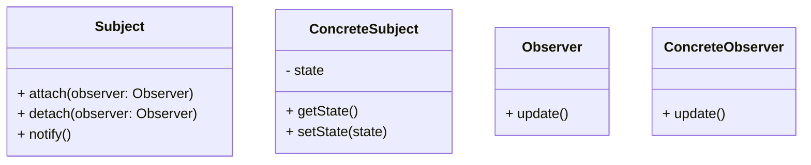

# Observer Design Pattern
> Version: dp_20231231_202019

- [Builder Design Pattern](#builder-design-pattern)
   * [Summary](#summary)
      + [Essence](#essence)
      + [Real examples](#real-examples)
   * [Implementation](#implementation)
      + [How to use it?](#how-to-use-it)
      + [Python code examples:](#python-code-examples)
   * [Analysis](#analysis)
      + [Cleaner Code?](#cleaner-code)
      + [Readable Code?](#readable-code)
      + [Replaceable code?](#replaceable-code)
      + [Testable code?](#testable-code)
      + [Advantages?](#advantages)
      + [Disadvantages?](#disadvantages)
   * [Remarks](#remarks)
      + [Concerns and Tips?](#concerns-and-tips)
      + [Execrises](#execrises)

## Summary

### Essence
Decouples the subject from its observers using an interface

### Real examples

- Event handling in graphical user interfaces
- Notification systems in social media platforms
- Stock market monitoring systems
- Weather monitoring systems
- Message broadcasting systems




## Implementation
### How to use it?
To use the Observer design pattern, follow these steps:
1. Define the Subject interface with methods to attach, detach, and notify observers.
2. Implement the ConcreteSubject class that maintains a list of observers and notifies them when its state changes.
3. Define the Observer interface with a method to update.
4. Implement the ConcreteObserver class that implements the update method and registers itself with the subject.
5. Use the attach and detach methods to add or remove observers as needed.
6. Call the notify method on the subject whenever its state changes.

### Python code examples:
```python

from abc import ABC, abstractmethod

class Subject(ABC):
    @abstractmethod
    def attach(self, observer):
        pass

    @abstractmethod
    def detach(self, observer):
        pass

    @abstractmethod
    def notify(self):
        pass


class ConcreteSubject(Subject):
    def __init__(self):
        self.observers = []
        self.state = None

    def attach(self, observer):
        self.observers.append(observer)

    def detach(self, observer):
        self.observers.remove(observer)

    def notify(self):
        for observer in self.observers:
            observer.update()

    def get_state(self):
        return self.state

    def set_state(self, state):
        self.state = state
        self.notify()


class Observer(ABC):
    @abstractmethod
    def update(self):
        pass


class ConcreteObserver(Observer):
    def __init__(self, name):
        self.name = name
        self.state = None

    def update(self):
        self.state = self.subject.get_state()
        print(f'{self.name} received update: {self.state}')


subject = ConcreteSubject()
observer1 = ConcreteObserver('Observer 1')
observer2 = ConcreteObserver('Observer 2')

subject.attach(observer1)
subject.attach(observer2)

subject.set_state('State 1')
subject.set_state('State 2')

subject.detach(observer2)

subject.set_state('State 3')

```

- The Python code example demonstrates the Observer design pattern by implementing a subject and two observers. The subject maintains a list of observers and notifies them when its state changes. The observers update their state based on the notifications.   


## Analysis
### Cleaner Code?

- Separates the concerns of the subject and observers
- Promotes the Single Responsibility Principle
- Allows for easy extensibility and maintainability

### Readable Code?

- Clearly defines the relationship between the subject and observers
- Separates the logic of updating the observers from maintaining the subject's state
- Promotes code reuse

### Replaceable code?

- Promotes loose coupling between the subject and observers
- Allows for dynamic binding at runtime
- Enables the subject to notify a heterogeneous group of observers

### Testable code?

- Enables unit testing of individual observers
- Allows for easy mocking and stubbing in unit tests
- Facilitates testing of different scenarios

### Advantages?

- Flexibility and extensibility
- Loose coupling
- Reusability
- Testability
- Scalability

### Disadvantages?

- Performance impact
- Inefficient updates
- Potential memory leaks
- Order of notifications


## Remarks
### Concerns and Tips?

- Performance and scalability should be considered
- Handle concurrent updates properly
- Use meaningful names for classes
- Consider using an event-driven architecture
- Use dependency injection
- Avoid circular dependencies
- Avoid relying on the order of notifications
- Avoid memory leaks


### Execrises

- Q: What is the purpose of the Observer design pattern?

  - A: The purpose of the Observer design pattern is to define a one-to-many dependency between objects, so that when one object changes state, all its dependents are notified and updated automatically.
- Q: How does the Observer design pattern promote loose coupling?

  - A: The Observer design pattern promotes loose coupling by using an interface to define the communication between the subject and observers. The subject only knows about the Observer interface, not the concrete implementations of the observers.
- Q: What are the advantages of using the Observer design pattern?

  - A: Some advantages of using the Observer design pattern include flexibility and extensibility, loose coupling, reusability, testability, and scalability.
- Q: How can the Observer design pattern be used in event handling?

  - A: The Observer design pattern can be used in event handling by making the event source the subject and the event listeners the observers. When an event occurs, the subject notifies all the observers, allowing them to react to the event.
- Q: What are some potential concerns when using the Observer design pattern?

  - A: Some potential concerns when using the Observer design pattern include performance impact, scalability issues with a large number of observers, and the non-deterministic order of notifications.

