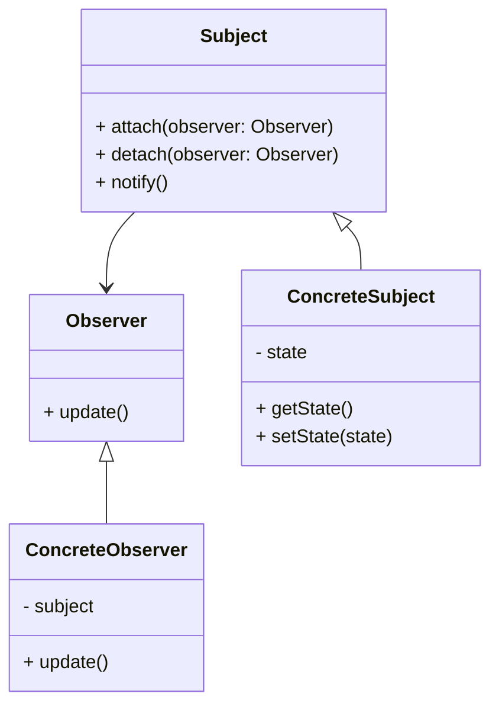

# Observer Design Pattern
> Version: dp_20231231_234226

- [Builder Design Pattern](#builder-design-pattern)
   * [Summary](#summary)
      + [Essence](#essence)
      + [Real examples](#real-examples)
   * [Implementation](#implementation)
      + [How to use it?](#how-to-use-it)
      + [Python code examples:](#python-code-examples)
   * [Analysis](#analysis)
      + [Cleaner Code?](#cleaner-code)
      + [Readable Code?](#readable-code)
      + [Replaceable code?](#replaceable-code)
      + [Testable code?](#testable-code)
      + [Advantages?](#advantages)
      + [Disadvantages?](#disadvantages)
   * [Remarks](#remarks)
      + [Concerns and Tips?](#concerns-and-tips)
      + [Execrises](#execrises)

## Summary

### Essence

- The Observer pattern establishes a one-to-many dependency between objects, allowing changes in one object to be automatically reflected in others.
- This pattern promotes loose coupling, enabling objects to interact without explicit knowledge of each other.
- The key aspect of this pattern is the separation of the subject and observers, allowing for dynamic and flexible communication.
- This pattern is particularly useful in event-driven systems where multiple components need to react to changes in a shared state.

### Real examples

- In a stock market application, the stock market (subject) updates the prices of stocks and the traders (observers) react accordingly.
- In a weather monitoring system, the weather station (subject) detects changes in weather conditions and the display devices (observers) update their displays.
- In a messaging application, the message sender (subject) sends a new message and the receivers (observers) display the message.
- In GUI frameworks, UI elements (observers) update based on changes in underlying data (subject).
- In distributed systems, different nodes need to synchronize their state.




## Implementation
### How to use it?
To use the Observer design pattern:
1. Define the Subject interface with methods to attach, detach, and notify observers.
2. Implement the Subject interface in a concrete subject class.
3. Define the Observer interface with a method to update.
4. Implement the Observer interface in concrete observer classes.
5. In the subject class, maintain a list of observers and notify them when the subject's state changes.
6. In the observer classes, implement the update method to react to changes in the subject.

### Python code examples:
```python

from abc import ABC, abstractmethod

class Subject(ABC):
    def __init__(self):
        self.observers = []

    def attach(self, observer):
        self.observers.append(observer)

    def detach(self, observer):
        self.observers.remove(observer)

    def notify(self):
        for observer in self.observers:
            observer.update()

    @abstractmethod
    def get_state(self):
        pass

    @abstractmethod
    def set_state(self, state):
        pass


class Observer(ABC):
    @abstractmethod
    def update(self):
        pass


class ConcreteSubject(Subject):
    def __init__(self):
        super().__init__()
        self.state = None

    def get_state(self):
        return self.state

    def set_state(self, state):
        self.state = state
        self.notify()


class ConcreteObserver(Observer):
    def __init__(self, subject):
        self.subject = subject

    def update(self):
        state = self.subject.get_state()
        # Do something with the state


subject = ConcreteSubject()
observer1 = ConcreteObserver(subject)
observer2 = ConcreteObserver(subject)

subject.attach(observer1)
subject.attach(observer2)

subject.set_state('new state')

```

- The Python code example demonstrates the implementation of the Observer pattern. The Subject class defines methods to attach, detach, and notify observers. The ConcreteSubject class maintains a state and notifies observers when the state changes. The Observer class defines a method to update, and the ConcreteObserver class reacts to state changes in the subject.   


## Analysis
### Maintainability: 
To what extent is your code characterized by cleanliness and readability?
#### Cleaner Code?

- The Observer pattern separates the logic for state updates from the logic for reacting to these changes, leading to more modular code.
- It adheres to the single responsibility principle, with clear and distinct roles for the subject and observers.
- The pattern encapsulates the state and the logic for managing observers within the subject, providing a clean interface for interaction.
- It promotes code reuse by allowing observer classes to be used across different subjects.

#### Readable Code?

- The Observer pattern provides a standardized way for objects to communicate and react to state changes, making the code easier to understand.
- The design of the pattern is intuitive, aiding developers in understanding and reasoning about the code.
- The use of observer interfaces and methods with descriptive names makes the code self-documenting.


### Testability: 
Can your code be methodically and comprehensively tested?


### Adaptability: 
How readily can your code be substituted or modified?
#### Replaceable code?

- The Observer pattern promotes loose coupling, allowing observers to be easily replaced without affecting the subject or other observers.
- The pattern is open for extension, allowing new observers to be added without modifying the subject or existing observers.
- The subject depends on abstractions (observer interfaces) rather than concrete implementations, enabling easy replacement of observers.


### Scalability:
Are your architectural components characterized by loose coupling?


### Tradeoffs:
#### Advantages?

- The Observer pattern allows for dynamic and flexible communication between objects, making it easy to add or remove observers.
- Observer classes can be reused across different subjects, promoting code reuse.
- The pattern enables scalable architectures by allowing for dynamic composition of objects and scalable event handling.
- The loose coupling between the subject and observers enhances testability.

#### Disadvantages?

- The Observer pattern can introduce overhead due to the need for maintaining a list of observers and notifying them on state changes.
- The order in which observers are notified may be non-deterministic, leading to unpredictable behavior.
- Observers may be notified even when they are not interested in the specific state change, resulting in unnecessary updates.
- Avoid tightly coupling the subject and observers as it reduces flexibility and makes the code harder to maintain and extend.
- Avoid relying on the order of notifications as it can lead to unpredictable behavior.
- Avoid unnecessary updates by carefully selecting the state changes to notify observers about, to improve performance and efficiency.


## Remarks
### Concerns and Tips?

- Performance impact due to maintaining a list of observers and notifying them on state changes.
- Non-deterministic order of notifications can lead to unpredictable behavior.
- Potential inefficiency when notifying observers that are not interested in the specific state change.
- Use meaningful names for the subject and observer classes to improve code readability.
- Follow the single responsibility principle by keeping the subject and observer classes focused on their respective responsibilities.
- Consider using an event bus or message broker to handle the communication between the subject and observers, especially in complex systems.
- Avoid circular dependencies between the subject and observers.
- Handle the case where an observer unsubscribes from the subject, to prevent memory leaks or unexpected behavior.
- Consider thread safety if the subject and observers are accessed from multiple threads.
- Refer to 'Design Patterns: Elements of Reusable Object-Oriented Software' by Erich Gamma et al., 'Head First Design Patterns' by Eric Freeman and Elisabeth Robson, and 'Clean Architecture: A Craftsman's Guide to Software Structure and Design' by Robert C. Martin for further studies.


### Execrises

- Q: What is the purpose of the Observer design pattern?

  - A: The purpose of the Observer design pattern is to establish a one-to-many dependency between objects, where changes in one object are automatically reflected in other objects.
- Q: How does the Observer pattern help in making the code clean and maintainable?

  - A: The Observer pattern promotes separation of concerns, encapsulation, and code reuse, leading to cleaner and more maintainable code.
- Q: What are the advantages of using the Observer pattern?

  - A: The advantages of using the Observer pattern include flexibility, reusability, scalability, and testability.
- Q: What are the disadvantages of using the Observer pattern?

  - A: The disadvantages of using the Observer pattern include potential performance impact, non-deterministic order of notifications, and inefficient updates.
- Q: How can you ensure thread safety when using the Observer pattern?

  - A: Thread safety can be ensured by adding synchronization mechanisms when accessing the subject and observers from multiple threads.
- Q: How can you avoid circular dependencies between the subject and observers?

  - A: Circular dependencies can be avoided by carefully designing the interactions between the subject and observers and using dependency injection or event bus solutions.
- Q: How can you handle the case where an observer unsubscribes from the subject?

  - A: The subject should provide a method for observers to unsubscribe, and the subject should handle the removal of unsubscribed observers from its list of observers.
- Q: How can you improve the performance of the Observer pattern?

  - A: Performance can be improved by carefully selecting the state changes to notify observers about and avoiding unnecessary updates.
- Q: Can you give an example of a real product or system that uses the Observer pattern?

  - A: One example is a stock market application, where the stock market acts as the subject and the stock traders act as observers. When the stock market updates the prices of stocks, the traders are notified and can react accordingly.

