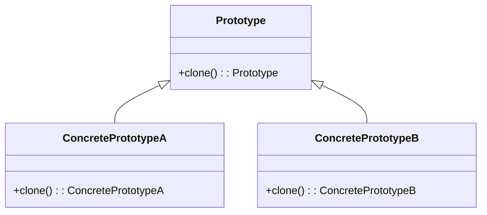

# Prototype Design Pattern
> Version: dp_20231231_202019

- [Builder Design Pattern](#builder-design-pattern)
   * [Summary](#summary)
      + [Essence](#essence)
      + [Real examples](#real-examples)
   * [Implementation](#implementation)
      + [How to use it?](#how-to-use-it)
      + [Python code examples:](#python-code-examples)
   * [Analysis](#analysis)
      + [Cleaner Code?](#cleaner-code)
      + [Readable Code?](#readable-code)
      + [Replaceable code?](#replaceable-code)
      + [Testable code?](#testable-code)
      + [Advantages?](#advantages)
      + [Disadvantages?](#disadvantages)
   * [Remarks](#remarks)
      + [Concerns and Tips?](#concerns-and-tips)
      + [Execrises](#execrises)

## Summary

### Essence
The Prototype design pattern allows for the creation of new objects by cloning existing objects. It eliminates the need for creating new objects from scratch and provides a way to dynamically create new instances at runtime. This promotes code reuse, modularity, and flexibility. The essence of the Prototype design pattern is to use a prototype object as a blueprint for creating new objects. The prototype object serves as a template from which new objects can be cloned. This simplifies the object creation process and improves code readability and maintainability.

### Real examples

- Creating objects with complex initialization processes
- Creating objects with similar properties and behaviors
- Creating objects at runtime without relying on subclasses




## Implementation
### How to use it?
To use the Prototype design pattern, follow these steps:
1. Create an abstract prototype class that defines the clone method.
2. Create concrete prototype classes that inherit from the prototype class and implement the clone method.
3. Use the clone method to create new objects by cloning existing objects.

### Python code examples:
```python
from copy import deepcopy


class Prototype:
    def __init__(self):
        self.name = 'Prototype'

    def clone(self):
        return deepcopy(self)


class ConcretePrototypeA(Prototype):
    def __init__(self):
        super().__init__()
        self.type = 'ConcretePrototypeA'


class ConcretePrototypeB(Prototype):
    def __init__(self):
        super().__init__()
        self.type = 'ConcretePrototypeB'


if __name__ == '__main__':
    prototype_a = ConcretePrototypeA()
    clone_a = prototype_a.clone()
    print(clone_a.type)  # Output: ConcretePrototypeA

    prototype_b = ConcretePrototypeB()
    clone_b = prototype_b.clone()
    print(clone_b.type)  # Output: ConcretePrototypeB
```

- The Python code example demonstrates the Prototype design pattern. It defines a prototype class with a clone method, and concrete prototype classes that inherit from the prototype class and implement the clone method. Objects can be created by cloning existing objects.   


## Analysis
### Cleaner Code?

- Separates the object creation process from the client code
- Promotes code reuse by allowing objects to be cloned and modified as needed
- Reduces the complexity of object creation by eliminating the need for complex initialization processes

### Readable Code?

- Encapsulates the object creation process in a separate prototype class
- Promotes code reuse by allowing objects to be cloned and modified as needed
- Provides a clear and consistent way to create new objects by cloning existing objects

### Replaceable code?

- Decouples the object creation process from the client code
- Allows for the dynamic creation of new objects at runtime
- Promotes code reuse by allowing objects to be cloned and modified as needed

### Testable code?

- Decouples the object creation process from the client code
- Allows for the creation of test objects with specific properties and behaviors
- Promotes code reuse by allowing test objects to be cloned and modified as needed

### Advantages?

- Allows for the creation of new objects with minimal overhead
- Provides a way to dynamically create new instances at runtime
- Promotes code reuse and modularity
- Simplifies the object creation process
- Improves code readability and maintainability
- Makes code easier to test

### Disadvantages?

- Cloning objects can be resource-intensive, especially for complex objects
- Cloned objects may retain references to the original object, leading to unexpected behavior
- Requires careful handling of object references and state


## Remarks
### Concerns and Tips?

- The Prototype design pattern may not be suitable for all scenarios
- Cloning objects can lead to increased memory usage
- The use of prototypes may introduce additional complexity and overhead in the codebase
- Consider the performance implications of cloning objects
- Pay attention to object references and state when cloning objects
- Test the cloning process thoroughly to ensure expected behavior
- Refer to 'Prototype Design Pattern' by Sourabh Sharma, International Journal of Computer Science and Information Technologies, 2015
- Refer to 'Design Patterns: Elements of Reusable Object-Oriented Software' by Erich Gamma, Richard Helm, Ralph Johnson, and John Vlissides, 1994
- Refer to 'Head First Design Patterns' by Eric Freeman, Elisabeth Robson, Bert Bates, and Kathy Sierra, 2004


### Execrises

- Q: What is the purpose of the Prototype design pattern?

  - A: The purpose of the Prototype design pattern is to create new objects by cloning existing objects, without relying on subclasses or complex initialization processes.
- Q: How does the Prototype design pattern promote code reuse?

  - A: The Prototype design pattern allows objects to be cloned and modified as needed, instead of creating new objects with similar properties and behaviors. This reduces the amount of duplicate code and promotes code reuse.
- Q: What are the advantages of using the Prototype design pattern?

  - A: The advantages of using the Prototype design pattern include minimal overhead in creating new objects, dynamic creation of instances at runtime, code reuse and modularity, simplified object creation process, improved code readability and maintainability, and easier testing.
- Q: What are the disadvantages of using the Prototype design pattern?

  - A: The disadvantages of using the Prototype design pattern include resource-intensive cloning of objects, potential retention of references to the original object in cloned objects, and the need for careful handling of object references and state.
- Q: How does the Prototype design pattern help in making components loosely coupled?

  - A: The Prototype design pattern decouples the object creation process from the client code by allowing the client code to clone an existing object without knowing the details of how the object is created. This promotes flexibility and interchangeability of components.
- Q: How can the Prototype design pattern be used to make code easier to test?

  - A: The Prototype design pattern makes code easier to test by decoupling the object creation process from the client code. The client code only needs to clone an existing object, which simplifies the testing process. It also allows for the creation of test objects with specific properties and behaviors by cloning existing objects and modifying them as needed.
- Q: What are some concerns when using the Prototype design pattern?

  - A: Some concerns when using the Prototype design pattern include its suitability for all scenarios, potential memory usage for cloning large or complex objects, and the introduction of additional complexity and overhead in the codebase.
- Q: How can the Prototype design pattern improve code readability?

  - A: The Prototype design pattern improves code readability by encapsulating the object creation process in a separate prototype class. This makes the code more modular and easier to understand. It also promotes code reuse and provides a clear and consistent way to create new objects by cloning existing objects.

