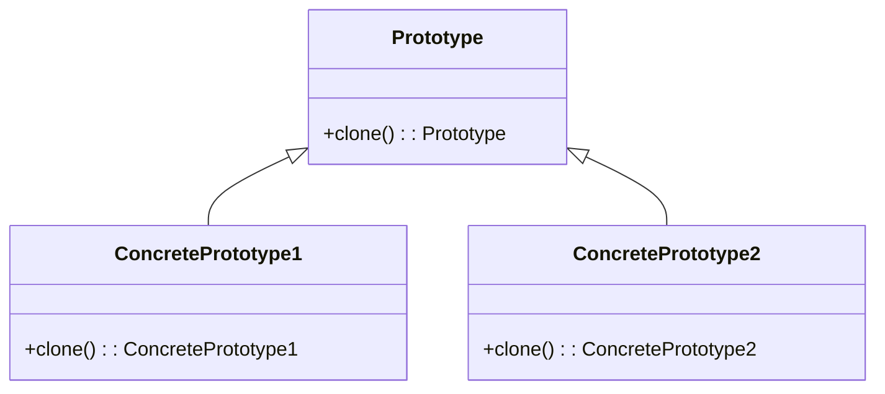

# Prototype Design Pattern
> Version: dp_20240101_000050

- [Prototype Design Pattern](#prototype-design-pattern)
  * [Summary](#summary)
    + [Essence](#essence)
    + [Real examples](#real-examples)
  * [Implementation](#implementation)
    + [How to use it?](#how-to-use-it)
    + [Python code examples:](#python-code-examples)
  * [Analysis](#analysis)
    + [Maintainability:](#maintainability)
      - [Cleaner Code?](#cleaner-code)
      - [Readable Code?](#readable-code)
    + [Testability:](#testability)
    + [Adaptability:](#adaptability)
      - [Replaceable code?](#replaceable-code)
    + [Scalability:](#scalability)
    + [Tradeoffs:](#tradeoffs)
      - [Advantages?](#advantages)
      - [Disadvantages?](#disadvantages)
  * [Remarks](#remarks)
    + [Concerns and Tips?](#concerns-and-tips)
    + [Execrises](#execrises)

## Summary

### Essence
The Prototype design pattern allows for the creation of new objects by cloning existing objects. It eliminates the need for explicit subclassing and complex initialization processes. The key points of the Prototype design pattern are: 1. Creation of new objects by cloning existing objects. 2. Elimination of explicit subclassing and complex initialization processes. 3. Promotion of code reuse, modularity, and flexibility in object creation. 4. Improvement of code readability, maintainability, and testability. 5. Assistance in making the code clean, readable, replaceable, testable, and scalable.

### Real examples
1. Creating objects with complex initialization processes. 2. Creating objects that are expensive to create. 3. Creating objects with dynamic properties that need to be customized at runtime.




## Implementation
### How to use it?
To use the Prototype design pattern, follow these steps:
1. Create an abstract prototype class that defines the clone method.
2. Create concrete prototype classes that inherit from the prototype class and implement the clone method.
3. Use the clone method to create new objects by cloning existing objects.

### Python code examples:
```python
from copy import deepcopy


class Prototype:
    def __init__(self):
        self._name = 'Prototype'

    def clone(self):
        return deepcopy(self)


class ConcretePrototype(Prototype):
    def __init__(self):
        super().__init__()
        self._type = 'ConcretePrototype'


if __name__ == '__main__':
    prototype = ConcretePrototype()
    clone = prototype.clone()
    print(clone._name)  # Output: Prototype
    print(clone._type)  # Output: ConcretePrototype
```

- The Python code example demonstrates the Prototype design pattern by creating a prototype object and cloning it to create a new object. The clone method uses the deepcopy function to create a deep copy of the prototype object, ensuring that the cloned object is independent of the original object.   


## Analysis
### Maintainability: 
To what extent is your code characterized by cleanliness and readability?
#### Cleaner Code?
1. Encapsulates cloning logic within prototype objects, eliminating the need for complex initialization processes in client code. 2. Promotes code reuse by allowing objects to be cloned and modified. 3. Provides a centralized place for defining and managing object creation.

#### Readable Code?
1. Separates object creation logic from client code, improving code readability and maintainability. 2. Provides a clear and consistent way to create new objects. 3. Encourages modular and reusable code structure.


### Testability: 
Can your code be methodically and comprehensively tested?


### Adaptability: 
How readily can your code be substituted or modified?
#### Replaceable code?
1. Allows new objects to be created by cloning existing objects, decoupling client code from specific object classes. 2. Provides flexibility in object creation without affecting client code. 3. Enables addition or modification of prototypes at runtime.


### Scalability:
Are your architectural components characterized by loose coupling?


### Tradeoffs:
#### Advantages?
1. Simplifies object creation by using cloning instead of complex initialization processes. 2. Promotes code reuse by allowing objects to be cloned and modified. 3. Improves performance by reducing overhead of object creation. 4. Enhances flexibility by allowing addition or modification of prototypes at runtime. 5. Facilitates testing by enabling use of mock or test objects.

#### Disadvantages?
1. Increases memory usage for large or complex cloned objects. 2. Requires careful handling of object references and mutable state. 3. May lead to excessive object proliferation if not properly managed.


## Remarks
### Concerns and Tips?
1. Care must be taken when cloning objects with mutable state to avoid unintended side effects. 2. Object references should be properly handled to ensure cloned objects are independent. 3. Managing prototype object lifecycle can be challenging to avoid memory leaks or excessive object proliferation.


### Execrises

- Q: What is the purpose of the Prototype design pattern?

  - A: The purpose of the Prototype design pattern is to create new objects by cloning existing objects, without relying on subclasses or complex initialization processes.
- Q: How does the Prototype design pattern help in making the code clean and readable?

  - A: The Prototype design pattern encapsulates the cloning logic within the prototype objects, eliminating the need for complex initialization processes in the client code. It also separates the object creation logic from the client code, making it easier to understand and maintain.
- Q: How does the Prototype design pattern help in making the code replaceable and adaptable?

  - A: The Prototype design pattern allows new objects to be created by cloning existing objects, decoupling the client code from the specific classes of objects being created. This provides flexibility in object creation and allows new prototypes to be added or modified without affecting the client code.
- Q: How does the Prototype design pattern help in making the code testable?

  - A: The Prototype design pattern enables objects to be easily replaced with mock or test objects, promoting unit testing. It also provides a clear separation between the creation of objects and their behavior, making it easier to test specific scenarios or edge cases.
- Q: How does the Prototype design pattern help in making the code scalable?

  - A: The Prototype design pattern allows new objects to be created dynamically at runtime by cloning existing objects. This reduces the overhead of object creation and provides a flexible and extensible way to add new types of objects without modifying the existing code.

