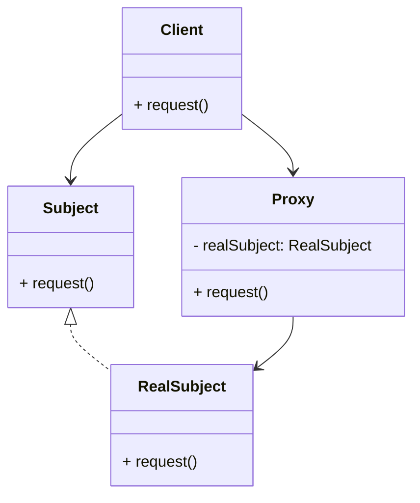

# Proxy Design Pattern
> Version: dp_20240101_000050

- [Proxy Design Pattern](#proxy-design-pattern)
  * [Summary](#summary)
    + [Essence](#essence)
    + [Real examples](#real-examples)
  * [Implementation](#implementation)
    + [How to use it?](#how-to-use-it)
    + [Python code examples:](#python-code-examples)
  * [Analysis](#analysis)
    + [Maintainability:](#maintainability)
      - [Cleaner Code?](#cleaner-code)
      - [Readable Code?](#readable-code)
    + [Testability:](#testability)
    + [Adaptability:](#adaptability)
      - [Replaceable code?](#replaceable-code)
    + [Scalability:](#scalability)
    + [Tradeoffs:](#tradeoffs)
      - [Advantages?](#advantages)
      - [Disadvantages?](#disadvantages)
  * [Remarks](#remarks)
    + [Concerns and Tips?](#concerns-and-tips)
    + [Execrises](#execrises)

## Summary

### Essence

- The Proxy design pattern is a structural pattern that provides a surrogate or placeholder for another object to control access to it.
- It allows for the creation of a representative object that controls the access to the original object, providing additional functionality or restrictions as needed.
- The proxy object provides the same interface as the real object, allowing the client to interact with it in the same way.
- The proxy object can add extra behavior before or after forwarding the request to the real object.

### Real examples

- Caching the results of database queries to improve performance.
- Controlling access to sensitive resources or operations.
- Delaying the creation of expensive objects until they are actually needed.
- Implementing remote communication between different systems or processes.
- Caching Proxy: A proxy object can be used to cache the results of expensive operations. Instead of executing the operation every time, the proxy checks if the result is already cached and returns it if available. This can greatly improve performance.
- Remote Proxy: A proxy object can be used to represent a remote object that resides in a different address space or on a different machine. The proxy handles the communication with the remote object, hiding the complexity from the client.
- Virtual Proxy: A proxy object can be used to create a placeholder for an expensive-to-create object. The proxy delays the creation of the real object until it is actually needed, improving performance by avoiding unnecessary initialization.
- Protection Proxy: A proxy object can be used to control access to a sensitive object. The proxy checks the permissions of the client before allowing access to the real object, providing an additional layer of security.




## Implementation
### How to use it?
To use the Proxy design pattern, follow these steps:
1. Create an interface or abstract class that defines the common methods between the real object and the proxy object.
2. Implement the real object class that provides the actual functionality.
3. Implement the proxy object class that acts as a wrapper around the real object.
4. In the proxy object, implement the same methods as the real object and add any additional behavior or restrictions.
5. In the client code, create an instance of the proxy object and use it to interact with the real object.

### Python code examples:
```python
1. Example of a Caching Proxy in Python:

```python
from functools import lru_cache

class RealObject:
    @lru_cache
    def expensive_operation(self, param):
        # Perform expensive operation
        return result

class ProxyObject:
    def __init__(self):
        self.real_object = RealObject()

    def expensive_operation(self, param):
        # Check if result is already cached
        if param in self.real_object.expensive_operation.cache:
            return self.real_object.expensive_operation.cache[param]
        else:
            result = self.real_object.expensive_operation(param)
            self.real_object.expensive_operation.cache[param] = result
            return result
```
2. Example of a Remote Proxy in Python using the requests library:

```python
import requests

class RealObject:
    def remote_operation(self, param):
        # Make remote API call
        response = requests.get('https://api.example.com', params={'param': param})
        return response.json()

class ProxyObject:
    def __init__(self):
        self.real_object = RealObject()

    def remote_operation(self, param):
        # Add authentication headers
        headers = {'Authorization': 'Bearer token'}
        response = requests.get('https://api.example.com', params={'param': param}, headers=headers)
        return response.json()

```

- 1. Caching Proxy: The proxy object caches the results of expensive operations using the lru_cache decorator from the functools module.
- 2. Remote Proxy: The proxy object adds authentication headers to the requests made to a remote API using the requests library.
- 3. Virtual Proxy: The proxy object delays the creation of the real object until it is actually needed, improving performance by avoiding unnecessary initialization.
- 4. Protection Proxy: The proxy object checks the permissions of the client before allowing access to the real object, providing an additional layer of security.   


## Analysis
### Maintainability: 
To what extent is your code characterized by cleanliness and readability?
#### Cleaner Code?

- The proxy object separates the client code from the complex logic of the real object, improving the clarity and maintainability of the code.
- The proxy object can handle additional responsibilities such as caching or security checks, keeping the real object focused on its core functionality.
- The proxy object can be reused in different parts of the codebase, providing a consistent interface and behavior for accessing the real object.

#### Readable Code?

- The use of a proxy object makes the intention of the code clear by providing a clear separation between the client and the real object.
- The proxy object can have meaningful names for its methods and properties, making the code more self-explanatory and easier to understand.
- The proxy object encapsulates the complex logic of the real object, making the code more readable by hiding unnecessary details.


### Testability: 
Can your code be methodically and comprehensively tested?


### Adaptability: 
How readily can your code be substituted or modified?
#### Replaceable code?

- The proxy object allows the client code to interact with the real object through an interface, reducing the dependencies and making it easier to replace the real object with a different implementation.
- The proxy object can be used as a dependency in other classes, allowing for easy replacement of the real object with a mock or stub object for testing purposes.
- The proxy object can dynamically substitute the real object with a different implementation based on certain conditions or configurations, providing flexibility and adaptability.


### Scalability:
Are your architectural components characterized by loose coupling?


### Tradeoffs:
#### Advantages?

- Improved Performance: The proxy object can add caching or other optimizations to improve the performance of the system.
- Enhanced Security: The proxy object can control access to sensitive resources or operations, providing an additional layer of security.
- Simplified Client Code: The proxy object provides a simplified interface for the client code, hiding the complexity of the real object.
- Flexibility and Adaptability: The proxy object allows for dynamic substitution of the real object, providing flexibility and adaptability to the system.
- Controlling access to sensitive resources or operations.
- Improving performance by caching expensive operations.
- Delaying the creation of expensive objects until they are actually needed.
- Providing a simplified interface for interacting with complex objects.
- Implementing remote communication between different systems or processes.

#### Disadvantages?

- Increased Complexity: The introduction of a proxy object adds an additional layer of complexity to the system.
- Overhead: The proxy object may introduce additional overhead in terms of memory usage and processing time.
- Potential Performance Trade-off: While the proxy object can improve performance in certain scenarios, it may also introduce additional overhead in others.
- Avoid tightly coupling the client code with the real object. Use the proxy object as an intermediary to decouple the client from the complexity of the real object.
- Avoid duplicating code between the proxy object and the real object. Use inheritance or composition to reuse common functionality.
- Avoid introducing unnecessary complexity by adding too many responsibilities to the proxy object. Keep the proxy focused on its role as a surrogate for the real object.


## Remarks
### Concerns and Tips?

- Choosing the right type of proxy for the specific requirements of the system.
- Balancing the performance improvements with the potential overhead introduced by the proxy object.
- Ensuring consistency between the behavior of the proxy object and the real object.
- Use meaningful names for the methods and properties of the proxy object to make the code more self-explanatory.
- Keep the responsibilities of the proxy object focused and avoid adding unnecessary complexity.
- Consider the trade-offs between performance improvements and potential overhead when using a proxy object.
- Choosing the Right Proxy Type: There are different types of proxies, such as virtual proxies, protection proxies, and remote proxies. It is important to choose the right type based on the specific requirements of the system.
- Balancing Performance and Overhead: The use of a proxy object can improve performance in certain scenarios, but it may also introduce additional overhead. It is important to carefully consider the trade-offs and choose the appropriate optimizations.
- Ensuring Consistency: When using a proxy object, it is important to ensure that the behavior of the proxy is consistent with the behavior of the real object. Any additional behavior or restrictions added by the proxy should not violate the expected behavior of the real object.
- Study on the Performance of Proxy Design Pattern in Distributed Systems: This study evaluates the performance impact of using proxy objects in distributed systems. It compares the performance of different proxy types and provides insights into the trade-offs involved.
- Study on the Security Benefits of Proxy Design Pattern in Web Applications: This study explores the security benefits of using proxy objects in web applications. It analyzes the effectiveness of different proxy types in protecting against common security vulnerabilities.
- Study on the Scalability of Proxy Design Pattern in Cloud Computing Environments: This study investigates the scalability of using proxy objects in cloud computing environments. It examines the impact of proxy caching and load balancing on the scalability of the system.


### Execrises

- Q: What is the purpose of the Proxy design pattern?

  - A: The purpose of the Proxy design pattern is to provide a surrogate or placeholder for another object to control access to it.
- Q: How does the Proxy design pattern help in making the code clean and maintainable?

  - A: The Proxy design pattern separates the client code from the complex logic of the real object, improving the clarity and maintainability of the code.
- Q: What are some real usage examples of the Proxy design pattern?

  - A: Some real usage examples of the Proxy design pattern include caching proxies, remote proxies, virtual proxies, and protection proxies.
- Q: How does the Proxy design pattern help in making the code testable?

  - A: The Proxy design pattern allows for easy replacement of the real object with a mock or stub object, enabling isolated unit tests of the client code.
- Q: What are some advantages of using the Proxy design pattern?

  - A: Some advantages of using the Proxy design pattern include improved performance, enhanced security, simplified client code, and flexibility/adaptability.
- Q: What are some disadvantages of using the Proxy design pattern?

  - A: Some disadvantages of using the Proxy design pattern include increased complexity, potential overhead, and potential performance trade-offs.
- Q: How does the Proxy design pattern help in making the code scalable?

  - A: The Proxy design pattern allows for dynamic loading, load balancing, and caching, which can improve the scalability of the system.
- Q: What are some concerns or considerations when using the Proxy design pattern?

  - A: Some concerns or considerations when using the Proxy design pattern include choosing the right proxy type, balancing performance and overhead, and ensuring consistency between the proxy and the real object.

