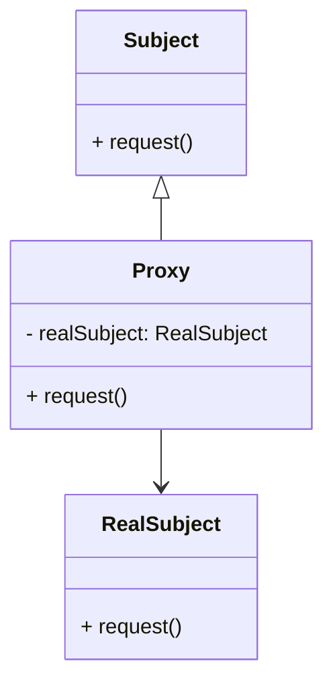

# Proxy Design Pattern
> Version: dp_20231231_202019

- [Builder Design Pattern](#builder-design-pattern)
   * [Summary](#summary)
      + [Essence](#essence)
      + [Real examples](#real-examples)
   * [Implementation](#implementation)
      + [How to use it?](#how-to-use-it)
      + [Python code examples:](#python-code-examples)
   * [Analysis](#analysis)
      + [Cleaner Code?](#cleaner-code)
      + [Readable Code?](#readable-code)
      + [Replaceable code?](#replaceable-code)
      + [Testable code?](#testable-code)
      + [Advantages?](#advantages)
      + [Disadvantages?](#disadvantages)
   * [Remarks](#remarks)
      + [Concerns and Tips?](#concerns-and-tips)
      + [Execrises](#execrises)

## Summary

### Essence

- The Proxy design pattern acts as a surrogate or placeholder for another object to control its access.
- It separates the access control and additional functionality from the core responsibilities of the object.
- This pattern can be used for caching, remote communication, lazy loading, and access control.
- It adheres to the Single Responsibility Principle by assigning specific responsibilities to the Proxy and RealSubject classes.

### Real examples

- Caching: A Proxy class can be used to cache the results of expensive database queries.
- Remote API: A Proxy class can be used to handle the communication with a remote API.
- Lazy Loading: A Proxy class can be used to delay the loading of large resources until they are actually needed.
- Access Control: A Proxy class can be used to enforce access control rules.




## Implementation
### How to use it?
To use the Proxy design pattern, create an interface (Subject) that both the RealSubject and Proxy classes implement. The Proxy class should have a reference to the RealSubject class and delegate requests to it. Clients should interact with the Proxy class instead of the RealSubject class.

### Python code examples:
```python
1. Caching Proxy Example:

```python
from datetime import datetime

class ExpensiveOperation:
    def execute(self):
        print('Executing expensive operation...')
        return 'Result'


class CachingProxy:
    def __init__(self):
        self.expensive_operation = ExpensiveOperation()
        self.cached_result = None
        self.last_execution_time = None

    def execute(self):
        if self.cached_result is not None and datetime.now() - self.last_execution_time < timedelta(minutes=5):
            print('Returning cached result...')
            return self.cached_result
        else:
            result = self.expensive_operation.execute()
            self.cached_result = result
            self.last_execution_time = datetime.now()
            return result


proxy = CachingProxy()
print(proxy.execute())
print(proxy.execute())
```

Output:
```
Executing expensive operation...
Result
Returning cached result...
Result
```
2. Remote Proxy Example:

```python
import requests


class RemoteAPI:
    def request(self, url):
        response = requests.get(url)
        return response.text


class RemoteProxy:
    def __init__(self):
        self.remote_api = RemoteAPI()

    def request(self, url):
        print('Making remote request...')
        return self.remote_api.request(url)


proxy = RemoteProxy()
print(proxy.request('https://example.com'))
```

Output:
```
Making remote request...
<html>...</html>

```

- 1. Caching Proxy Example: The Proxy class checks if the result of an expensive operation is already cached and returns it instead of making the actual request.
- 2. Remote Proxy Example: The Proxy class handles the communication with a remote API and provides a simplified interface for clients to interact with.   


## Analysis
### Cleaner Code?

- The Proxy pattern separates the concerns of accessing and controlling an object, making the code cleaner.
- It adheres to the Single Responsibility Principle, ensuring each class has a specific task.
- The pattern promotes code reusability by allowing multiple Proxy classes to be used with different RealSubject classes.

### Readable Code?

- The Proxy pattern makes the intent of the code clear by separating the access control from the core responsibilities of the RealSubject class.
- It provides a simplified interface for clients to interact with, hiding the complexity of the RealSubject class.
- The pattern helps in creating self-documenting code by encapsulating the access control within the Proxy class.

### Replaceable code?

- The Proxy pattern promotes loose coupling by allowing indirect communication between the client and the RealSubject class.
- It follows the Dependency Inversion principle by depending on abstractions rather than concrete implementations, allowing for flexibility in swapping different Proxy and RealSubject classes.

### Testable code?

- The Proxy pattern makes it easier to mock the RealSubject class during unit testing.
- It helps in isolating the code being tested by providing a separate class for access control.
- The pattern improves the testability of the code by providing a clear separation between the code that needs to be tested and the code that handles access control.

### Advantages?

- Access Control: The Proxy pattern provides a way to control access to an object.
- Performance Optimization: The Proxy pattern can be used to optimize performance by caching results or delaying expensive operations.
- Simplified Interface: The Proxy pattern provides a simplified interface for clients to interact with.
- Code Reusability: The Proxy pattern promotes code reusability by allowing multiple Proxy classes to be used with different RealSubject classes.

### Disadvantages?

- Increased Complexity: The Proxy pattern introduces additional complexity by adding an extra layer of indirection.
- Performance Overhead: The Proxy pattern can introduce performance overhead when additional functionality or access control checks are performed.
- Potential for Inconsistency: If the Proxy class is not implemented correctly, it can lead to inconsistencies.
- Increased Development Time: Implementing the Proxy pattern requires additional development time and effort.


## Remarks
### Concerns and Tips?

- Inconsistency: Ensure the Proxy class accurately mimics the behavior of the RealSubject class to avoid inconsistencies.
- Performance Overhead: Consider the performance implications of the Proxy pattern and optimize it if necessary.
- Increased Complexity: Be aware that the Proxy pattern adds an extra layer of indirection, which can increase the complexity of the codebase.
- Development Time: Implementing the Proxy pattern requires additional development time and effort.


### Execrises

- 1. Q: What is the purpose of the Proxy design pattern?
   
  - A: The purpose of the Proxy design pattern is to provide a surrogate or placeholder for another object to control access to it.
- 2. Q: How does the Proxy pattern help in making code clean?
   
  - A: The Proxy pattern helps in making code clean by separating concerns, improving readability, and promoting loose coupling.
- 3. Q: What are some advantages of using the Proxy pattern?
   
  - A: Some advantages of using the Proxy pattern include access control, performance optimization, simplified interface, and code reusability.
- 4. Q: What are some disadvantages of using the Proxy pattern?
   
  - A: Some disadvantages of using the Proxy pattern include increased complexity, performance overhead, potential for inconsistency, and increased development time.
- 5. Q: How can the Proxy pattern be used to optimize performance?
   
  - A: The Proxy pattern can be used to optimize performance by caching results, delaying expensive operations, or reducing network overhead.
- 6. Q: What are some concerns when using the Proxy pattern?
   
  - A: Some concerns when using the Proxy pattern include potential for inconsistency, performance overhead, increased complexity, and increased development time.

