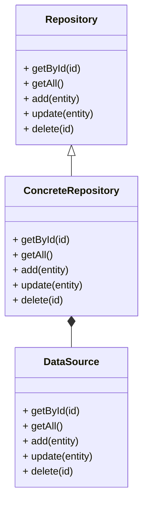

# Repository Design Pattern
> Version: dp_20231231_202019

- [Builder Design Pattern](#builder-design-pattern)
   * [Summary](#summary)
      + [Essence](#essence)
      + [Real examples](#real-examples)
   * [Implementation](#implementation)
      + [How to use it?](#how-to-use-it)
      + [Python code examples:](#python-code-examples)
   * [Analysis](#analysis)
      + [Cleaner Code?](#cleaner-code)
      + [Readable Code?](#readable-code)
      + [Replaceable code?](#replaceable-code)
      + [Testable code?](#testable-code)
      + [Advantages?](#advantages)
      + [Disadvantages?](#disadvantages)
   * [Remarks](#remarks)
      + [Concerns and Tips?](#concerns-and-tips)
      + [Execrises](#execrises)

## Summary

### Essence
The Repository design pattern provides a separation between the domain and data access layers of an application. It abstracts the data access logic and provides a consistent interface for accessing and manipulating data. This pattern encapsulates the details of data storage and retrieval, allowing the application to work with data in a more abstract and decoupled manner.

### Real examples

- In a web application, the Repository pattern can be used to separate the database access code from the business logic.
- In an e-commerce system, the Repository pattern can be used to handle product data retrieval and storage.
- In a mobile app, the Repository pattern can be used to manage user data.




## Implementation
### How to use it?
To use the Repository design pattern, follow these steps:
1. Define an interface or abstract class for the repository, specifying the methods for data access operations.
2. Implement the repository interface or extend the abstract class with a concrete repository class.
3. Implement the data access logic in the concrete repository class, using a data source or database connection.
4. Use the repository in the application code to perform data access operations.

### Python code examples:
```python
from abc import ABC, abstractmethod


class Repository(ABC):
    @abstractmethod
    def get_by_id(self, id):
        pass

    @abstractmethod
    def get_all(self):
        pass

    @abstractmethod
    def add(self, entity):
        pass

    @abstractmethod
    def update(self, entity):
        pass

    @abstractmethod
    def delete(self, id):
        pass


class ConcreteRepository(Repository):
    def get_by_id(self, id):
        # Implementation for getting entity by ID
        pass

    def get_all(self):
        # Implementation for getting all entities
        pass

    def add(self, entity):
        # Implementation for adding a new entity
        pass

    def update(self, entity):
        # Implementation for updating an existing entity
        pass

    def delete(self, id):
        # Implementation for deleting an entity by ID
        pass
```

- The Python code example demonstrates the implementation of the Repository design pattern using abstract classes and concrete classes. The abstract class defines the interface for data access operations, while the concrete class provides the implementation for these operations. This allows for easy switching between different repository implementations.   


## Analysis
### Cleaner Code?

- Separation of concerns: The Repository pattern separates the data access logic from the business logic, resulting in cleaner and more maintainable code.
- Single responsibility principle: The repository has the responsibility of handling data access operations, ensuring that each component has a clear and focused purpose.
- Encapsulation: The repository encapsulates the details of data storage and retrieval, providing a consistent and abstract interface for accessing data.

### Readable Code?

- Abstraction: The Repository pattern provides a higher level of abstraction for data access, making the code more readable and easier to understand.
- Clear separation of concerns: By separating the data access logic from the business logic, the code becomes more modular and easier to follow.
- Consistent interface: The repository provides a consistent interface for accessing data, making it easier for developers to work with and understand.

### Replaceable code?

- Dependency inversion: The Repository pattern promotes the use of interfaces or abstract classes for the repository, allowing for loose coupling between the application and the data access layer.
- Separation of concerns: By separating the data access logic from the business logic, the components become more loosely coupled, making it easier to replace or modify the data access implementation without affecting the rest of the application.
- Dependency injection: The use of dependency injection allows for the decoupling of the repository implementation from the application code, making it easier to switch between different repository implementations.

### Testable code?

- Mocking: The Repository pattern allows for easy mocking of the data access layer, making it simpler to write unit tests for the business logic without relying on a real database.
- Dependency injection: By using interfaces or abstract classes for the repository, dependencies can be easily injected, enabling the use of test doubles or mock objects during testing.
- Isolation: The repository isolates the data access logic, making it easier to test the business logic independently of the data source.

### Advantages?

- Separation of concerns: The Repository pattern separates the data access logic from the business logic, resulting in a more maintainable and modular codebase.
- Abstraction: The repository provides a higher level of abstraction for data access, making it easier to work with and understand.
- Testability: The repository allows for easy mocking and testing of the business logic without relying on a real database.
- Flexibility: The repository allows for easy switching between different data sources or databases without affecting the application code.
- Reusability: The repository can be reused across different parts of the application, reducing code duplication.

### Disadvantages?

- Increased complexity: The Repository pattern adds an additional layer of abstraction and complexity to the codebase, which may not be necessary for small or simple applications.
- Performance overhead: The use of the Repository pattern can introduce a performance overhead, as it adds an extra layer of indirection between the application and the data source.
- Learning curve: Developers who are not familiar with the Repository pattern may need to spend time learning and understanding its concepts and implementation.


## Remarks
### Concerns and Tips?

- Performance: The Repository pattern can introduce a performance overhead due to the additional layer of abstraction and indirection.
- Complexity: The use of the Repository pattern adds complexity to the codebase, which may not be necessary for small or simple applications.
- Learning curve: Developers who are not familiar with the Repository pattern may need to spend time learning and understanding its concepts and implementation.
- Programming tips: Start with a clear understanding of the data access requirements and design the repository interface accordingly. Use dependency injection to decouple the repository implementation from the application code. Keep the repository methods focused and granular, following the single responsibility principle. Consider using an ORM (Object-Relational Mapping) framework to simplify the data access implementation. Write unit tests for the repository to ensure its correctness and reliability.
- Tricky aspects: Choosing the right level of abstraction for the repository interface or abstract class. Deciding on the granularity of repository methods. Handling complex data access scenarios. Managing transactional operations and ensuring data consistency. Balancing performance considerations with the need for abstraction and decoupling.
- Recommended studies: "Design Patterns: Elements of Reusable Object-Oriented Software" by Erich Gamma, Richard Helm, Ralph Johnson, and John Vlissides. "Clean Architecture: A Craftsman's Guide to Software Structure and Design" by Robert C. Martin. "Domain-Driven Design: Tackling Complexity in the Heart of Software" by Eric Evans.


### Execrises

- 1. Q: What is the purpose of the Repository design pattern?
   
  - A: The purpose of the Repository design pattern is to provide a separation between the domain and data access layers of an application, allowing the application to retrieve and store data without directly interacting with the underlying database or data storage mechanism.

2. Q: How does the Repository pattern help in making the code clean?
   
  - A: The Repository pattern helps in making the code clean by separating the data access logic from the business logic, following the principles of separation of concerns and single responsibility.

3. Q: What are the advantages of using the Repository pattern?
   
  - A: The advantages of using the Repository pattern include separation of concerns, abstraction, testability, flexibility, and reusability.

4. Q: What are some potential concerns or drawbacks of using the Repository pattern?
   
  - A: Some potential concerns or drawbacks of using the Repository pattern include increased complexity, performance overhead, and a learning curve for developers who are not familiar with the pattern.

