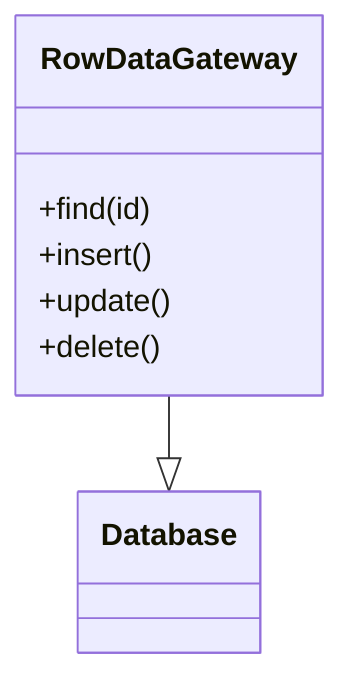

# Row Data Gateway
> Version: dp_20231231_202019

- [Builder Design Pattern](#builder-design-pattern)
   * [Summary](#summary)
      + [Essence](#essence)
      + [Real examples](#real-examples)
   * [Implementation](#implementation)
      + [How to use it?](#how-to-use-it)
      + [Python code examples:](#python-code-examples)
   * [Analysis](#analysis)
      + [Cleaner Code?](#cleaner-code)
      + [Readable Code?](#readable-code)
      + [Replaceable code?](#replaceable-code)
      + [Testable code?](#testable-code)
      + [Advantages?](#advantages)
      + [Disadvantages?](#disadvantages)
   * [Remarks](#remarks)
      + [Concerns and Tips?](#concerns-and-tips)
      + [Execrises](#execrises)

## Summary

### Essence
The Row Data Gateway design pattern provides a simple and efficient way to access and manipulate data in a database table. It encapsulates all the database operations for a specific table in a single object, promoting clean code and code reusability.

### Real examples

- Managing user accounts in a web application
- Storing and retrieving customer orders in an e-commerce system
- Managing employee records in a human resources system




## Implementation
### How to use it?
To use the Row Data Gateway design pattern, you need to create a class that represents a row in a database table. This class should have methods for finding, inserting, updating, and deleting rows. You can then use this class to perform database operations in your application.

### Python code examples:
```python
class ProductGateway:
    def __init__(self, db):
        self.db = db

    def find(self, id):
        # Database query to find product by ID
        pass

    def insert(self, product):
        # Database query to insert product
        pass

    def update(self, product):
        # Database query to update product
        pass

    def delete(self, id):
        # Database query to delete product by ID
        pass
```
   


## Analysis
### Cleaner Code?
Encapsulates all the database operations for a specific table in a single object, separating the database-related code from the rest of the application code. This improves code organization and maintainability.

### Readable Code?
Provides a clear and consistent interface for interacting with the database, making the code more readable and easier to understand.

### Replaceable code?
Encapsulates all the database operations in a separate object, promoting loose coupling between components. This allows for easier replacement of the database implementation without affecting other parts of the application.

### Testable code?
Provides a separate object for database operations, making it easier to write unit tests. It allows for easier mocking and stubbing of the database interactions.

### Advantages?

- Simplifies database operations by providing a single object for CRUD operations on a table.
- Promotes code reusability by encapsulating database operations in a separate object.
- Improves code readability and maintainability by separating database-related code from the rest of the application code.
- Facilitates unit testing by providing a separate object for database interactions.
- Promotes loose coupling between components by providing a well-defined interface for database operations.

### Disadvantages?

- May lead to an increase in the number of classes in the application.
- May introduce additional complexity, especially for complex database operations.
- Requires careful design and implementation to ensure proper separation of concerns.


## Remarks
### Concerns and Tips?

- Care should be taken to ensure proper separation of concerns between the Row Data Gateway and other components of the application.
- Complex database operations may require additional design considerations and implementation effort.
- Follow the Single Responsibility Principle when designing the Row Data Gateway class.
- Consider using appropriate database abstraction libraries or frameworks to simplify the implementation.
- Use dependency injection to provide the database connection to the Row Data Gateway class.


### Execrises

- Q: What is the purpose of the Row Data Gateway design pattern?

  - A: The purpose of the Row Data Gateway design pattern is to provide a simple and efficient way to access and manipulate data in a database table.
- Q: How does the Row Data Gateway design pattern help in making clean code?

  - A: The Row Data Gateway design pattern helps in making clean code by encapsulating all the database operations for a specific table in a single object, separating the database-related code from the rest of the application code.
- Q: How does the Row Data Gateway design pattern help in making the code readable?

  - A: By encapsulating all the database operations in a single object, the Row Data Gateway design pattern provides a clear and consistent interface for interacting with the database, making the code more readable.
- Q: How does the Row Data Gateway design pattern help in making the code easy to be tested?

  - A: The Row Data Gateway design pattern makes the code easy to be tested by providing a separate object for database operations, allowing for easier mocking and stubbing of the database interactions during unit testing.
- Q: How does the Row Data Gateway design pattern help in making components loose coupled?

  - A: The Row Data Gateway design pattern helps in making components loose coupled by encapsulating all the database operations in a separate object, providing a well-defined interface for database operations.

