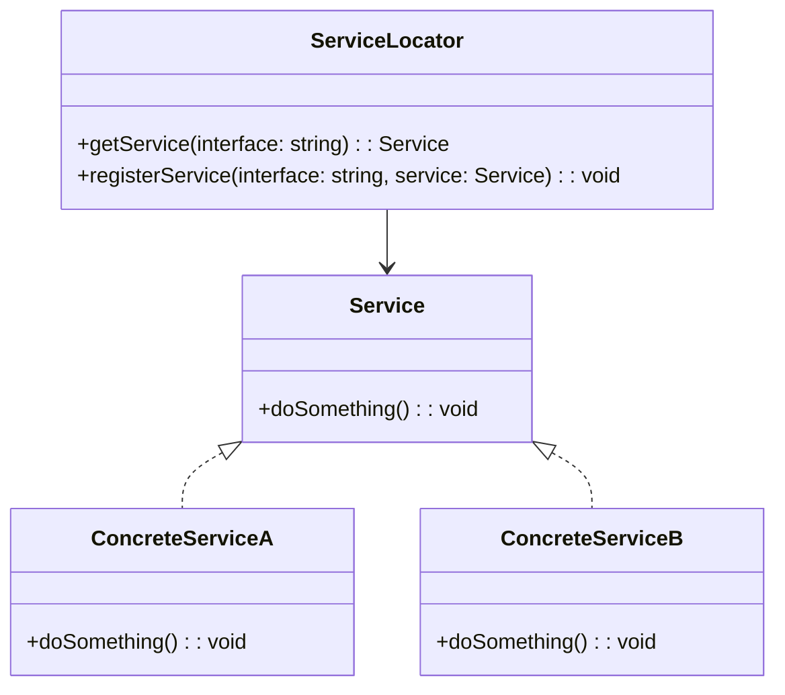

# Service Locator
> Version: dp_20231231_202019

- [Builder Design Pattern](#builder-design-pattern)
   * [Summary](#summary)
      + [Essence](#essence)
      + [Real examples](#real-examples)
   * [Implementation](#implementation)
      + [How to use it?](#how-to-use-it)
      + [Python code examples:](#python-code-examples)
   * [Analysis](#analysis)
      + [Cleaner Code?](#cleaner-code)
      + [Readable Code?](#readable-code)
      + [Replaceable code?](#replaceable-code)
      + [Testable code?](#testable-code)
      + [Advantages?](#advantages)
      + [Disadvantages?](#disadvantages)
   * [Remarks](#remarks)
      + [Concerns and Tips?](#concerns-and-tips)
      + [Execrises](#execrises)

## Summary

### Essence
The Service Locator pattern provides a centralized registry for accessing services or dependencies in a software system. It decouples client components from the concrete implementations of the services they depend on, improving maintainability and testability.

### Real examples

- Managing dependencies between components in a software system
- Providing a centralized registry for accessing services or resources
- Abstracting away service instantiation and configuration
- Enabling the use of mock services for testing purposes




## Implementation
### How to use it?
To use the Service Locator pattern, follow these steps:
1. Create a central Service Locator class that provides methods for registering and retrieving services.
2. Define interfaces for the services that will be used by client components.
3. Implement concrete service classes that implement the service interfaces.
4. Register the concrete service implementations with the Service Locator.
5. In client components, use the Service Locator to obtain instances of the required services.

### Python code examples:
```python
from typing import Dict

class ServiceLocator:
    _services: Dict[str, Service] = {}

    @staticmethod
    def register_service(interface: str, service: Service) -> None:
        ServiceLocator._services[interface] = service

    @staticmethod
    def get_service(interface: str) -> Service:
        return ServiceLocator._services.get(interface)


class Service:
    def do_something(self) -> None:
        pass


class ConcreteServiceA(Service):
    def do_something(self) -> None:
        print('Doing something in ConcreteServiceA')


class ConcreteServiceB(Service):
    def do_something(self) -> None:
        print('Doing something in ConcreteServiceB')


# Usage
ServiceLocator.register_service('Service', ConcreteServiceA())
service = ServiceLocator.get_service('Service')
service.do_something()  # Output: 'Doing something in ConcreteServiceA'
```

- The Python code example demonstrates the usage of the Service Locator pattern.
- The ServiceLocator class provides methods for registering and retrieving services.
- Client components can obtain instances of the required services by interacting with the ServiceLocator.
- The pattern decouples the client components from the concrete service implementations.
- This improves the modularity, maintainability, and testability of the codebase.   


## Analysis
### Cleaner Code?

- Decouples client components from service implementations
- Separates concerns and improves maintainability
- Reduces coupling and allows for easier substitution of services
- Promotes the single responsibility principle

### Readable Code?

- Provides a centralized registry for accessing services
- Defines and manages dependencies in one place
- Abstracts away service instantiation and configuration
- Reduces complexity and improves readability

### Replaceable code?

- Decouples client components from service implementations
- Allows for easy substitution of services
- Improves modularity and maintainability

### Testable code?

- Allows for the use of mock services
- Controls and tests dependencies in isolation
- Improves testability and enables comprehensive testing

### Advantages?

- Decouples client components from service implementations
- Provides a centralized registry for accessing services
- Allows for easy substitution of services
- Improves modularity and maintainability
- Enables the use of mock services for testing purposes

### Disadvantages?

- Can introduce performance overhead
- Can make code more complex if not used properly
- Can lead to a dependency on the Service Locator itself


## Remarks
### Concerns and Tips?

- One concern is the potential for creating a global state or dependency on a global object
- Properly manage the usage of the Service Locator to avoid complexity
- Consider using dependency injection frameworks or containers
- Manage the lifecycle of services properly
- Thoroughly test interactions with the Service Locator and dependencies


### Execrises

- Q: What is the purpose of the Service Locator pattern?

  - A: The purpose of the Service Locator pattern is to provide a centralized registry for accessing services or dependencies in a software system.
- Q: How does the Service Locator pattern help in making code clean?

  - A: The Service Locator pattern helps in making code clean by decoupling the client components from the concrete implementations of the services they depend on. This separation of concerns improves the maintainability and testability of the codebase.
- Q: What are the advantages of using the Service Locator pattern?

  - A: Some advantages of using the Service Locator pattern are: decoupling of client components from service implementations, centralized registry for accessing services, easy substitution of services, improved modularity and maintainability, and support for mock services in testing.
- Q: What are some concerns with the Service Locator pattern?

  - A: One concern with the Service Locator pattern is the potential for creating a global state or a dependency on a global object. Care should be taken to properly manage the usage of the Service Locator and ensure that it does not become a bottleneck or a source of complexity in the system.

