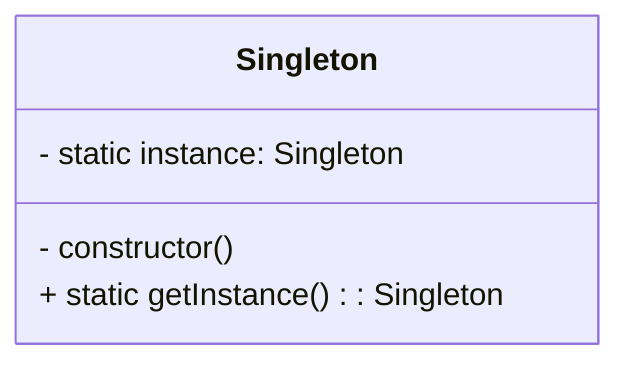

# Singleton Design Pattern
> Version: dp_20240101_000050

- [Singleton Design Pattern](#singleton-design-pattern)
  * [Summary](#summary)
    + [Essence](#essence)
    + [Real examples](#real-examples)
  * [Implementation](#implementation)
    + [How to use it?](#how-to-use-it)
    + [Python code examples:](#python-code-examples)
  * [Analysis](#analysis)
    + [Maintainability:](#maintainability)
      - [Cleaner Code?](#cleaner-code)
      - [Readable Code?](#readable-code)
    + [Testability:](#testability)
    + [Adaptability:](#adaptability)
      - [Replaceable code?](#replaceable-code)
    + [Scalability:](#scalability)
    + [Tradeoffs:](#tradeoffs)
      - [Advantages?](#advantages)
      - [Disadvantages?](#disadvantages)
  * [Remarks](#remarks)
    + [Concerns and Tips?](#concerns-and-tips)
    + [Execrises](#execrises)

## Summary

### Essence
The Singleton design pattern ensures that a class has only one instance and provides a global point of access to it. It controls object creation, limits the number of instances to one, and allows easy access to that instance globally. The purpose of the Singleton design pattern is to solve the problem of ensuring a class has only one instance and provides a global point of access to it. Key points of the Singleton design pattern include: only one instance of the class is created, the instance is globally accessible, the instance is lazily initialized, and the class controls its own instantiation.

### Real examples

- When there must be exactly one instance of a class available globally.
- When the single instance needs to be accessible from multiple parts of the system.
- Logger classes in a logging framework.
- Database connection classes in a database library.
- Configuration classes in a settings module.




## Implementation
### How to use it?
To use the Singleton design pattern, follow these steps:
1. Create a private static instance variable in the class.
2. Create a private constructor to prevent direct instantiation of the class.
3. Create a public static method that returns the instance of the class.
4. Use the public static method to access the Singleton instance.

### Python code examples:
```python
class Singleton:
    __instance = None

    @staticmethod
    def getInstance():
        if Singleton.__instance is None:
            Singleton()
        return Singleton.__instance

    def __init__(self):
        if Singleton.__instance is not None:
            raise Exception("This class is a Singleton!")
        else:
            Singleton.__instance = self
```

- The Singleton class ensures that only one instance is created and provides a static method to access that instance globally.   


## Analysis
### Maintainability: 
To what extent is your code characterized by cleanliness and readability?
#### Cleaner Code?
The Singleton design pattern helps in making the code clean by ensuring that there is only one instance of a class. This prevents unnecessary duplication of objects and reduces complexity.

#### Readable Code?
The Singleton design pattern makes the code more readable by providing a global point of access to the single instance. This allows other parts of the code to easily use and interact with the instance.


### Testability: 
Can your code be methodically and comprehensively tested?


### Adaptability: 
How readily can your code be substituted or modified?
#### Replaceable code?
The Singleton design pattern helps in making the code replaceable by encapsulating the creation and management of the single instance. This allows the instance to be easily replaced or extended without affecting other parts of the code.


### Scalability:
Are your architectural components characterized by loose coupling?


### Tradeoffs:
#### Advantages?

- Ensures a class has only one instance.
- Provides a global point of access to the instance.
- Allows for lazy initialization of the instance.
- Supports easy replacement or extension of the instance.
- Promotes loose coupling.

#### Disadvantages?

- Can make unit testing more difficult.
- Can introduce global state, which can be problematic in some scenarios.
- Can lead to potential thread-safety issues if not implemented correctly.
- Avoids unnecessary duplication of objects.
- Avoids complex object creation logic.
- Avoids tight coupling between classes.


## Remarks
### Concerns and Tips?

- Potential misuse of the Singleton pattern, leading to global state and tight coupling.
- Difficulty in unit testing code that depends on the Singleton instance.
- Potential thread-safety issues if not implemented correctly.
- Use the Singleton pattern sparingly and only when necessary.
- Consider using dependency injection instead of the Singleton pattern when possible.
- Be cautious of potential thread-safety issues when lazily initializing the Singleton instance.
- Ensuring thread-safety when lazily initializing the instance.
- Avoiding potential memory leaks when using the Singleton pattern.
- Handling the initialization of the Singleton instance in a multi-threaded environment.
- Recommended studies: 'Design Patterns: Elements of Reusable Object-Oriented Software' by Erich Gamma, Richard Helm, Ralph Johnson, and John Vlissides, 'Head First Design Patterns' by Eric Freeman and Elisabeth Robson, 'Design Patterns in Python' by Dmitri Nesteruk.


### Execrises

- Q: What is the purpose of the Singleton design pattern?

  - A: The purpose of the Singleton design pattern is to ensure that a class has only one instance and provide a global point of access to it.

Q: How does the Singleton pattern help in making the code clean?

  - A: The Singleton pattern helps in making the code clean by ensuring that there is only one instance of a class, reducing duplication and complexity.

Q: What are the advantages of using the Singleton pattern?

  - A: Some advantages of using the Singleton pattern include ensuring a class has only one instance, providing a global point of access to the instance, and supporting easy replacement or extension of the instance.

