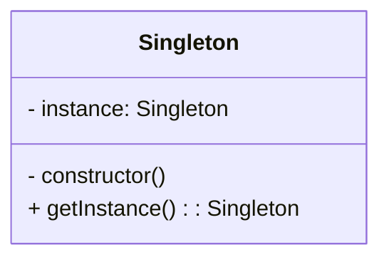

# Singleton Design Pattern
> Version: dp_20231231_202019

- [Builder Design Pattern](#builder-design-pattern)
   * [Summary](#summary)
      + [Essence](#essence)
      + [Real examples](#real-examples)
   * [Implementation](#implementation)
      + [How to use it?](#how-to-use-it)
      + [Python code examples:](#python-code-examples)
   * [Analysis](#analysis)
      + [Cleaner Code?](#cleaner-code)
      + [Readable Code?](#readable-code)
      + [Replaceable code?](#replaceable-code)
      + [Testable code?](#testable-code)
      + [Advantages?](#advantages)
      + [Disadvantages?](#disadvantages)
   * [Remarks](#remarks)
      + [Concerns and Tips?](#concerns-and-tips)
      + [Execrises](#execrises)

## Summary

### Essence
The Singleton design pattern restricts the instantiation of a class to a single object and provides a global point of access to it. It ensures that there is only one instance of a class throughout the system and allows lazy initialization of the instance.

### Real examples

- When there should be only one instance of a class throughout the system.
- When a single instance needs to be shared across multiple parts of the system.
- When lazy initialization of the instance is required.




## Implementation
### How to use it?
To use the Singleton design pattern, follow these steps:
1. Create a private static instance variable in the class.
2. Create a private constructor to prevent external instantiation.
3. Create a public static method that returns the instance of the class.
4. Access the Singleton instance using the public static method.

### Python code examples:
```python
class Singleton:
    __instance = None

    @staticmethod
    def getInstance():
        if Singleton.__instance is None:
            Singleton()
        return Singleton.__instance

    def __init__(self):
        if Singleton.__instance is not None:
            raise Exception("This class is a singleton!")
        else:
            Singleton.__instance = self
```
The Singleton design pattern ensures that there is only one instance of a class and provides a global point of access to it. It can be implemented by creating a private static instance variable, a private constructor, and a public static method that returns the instance. Lazy initialization can also be used.   


## Analysis
### Cleaner Code?
The Singleton design pattern helps in making clean code by avoiding unnecessary duplication of objects and reducing complexity.

### Readable Code?
The Singleton design pattern makes the code more readable by providing a clear and consistent way to access the single instance of a class throughout the codebase.

### Replaceable code?
The Singleton design pattern helps in making code replaceable by providing a global point of access to the instance and reducing dependencies between classes.

### Testable code?
The Singleton design pattern makes the code easy to be tested by allowing the instance to be replaced with a mock object during unit testing.

### Advantages?

- Provides a global point of access to a single instance.
- Ensures that there is only one instance of a class.
- Allows lazy initialization of the instance.
- Reduces the complexity of managing multiple instances.
- Improves performance by avoiding unnecessary object creation.
- Solves the problem of ensuring that there is only one instance of a class and provides a global point of access to it.

### Disadvantages?

- Can introduce global state, which can make the code harder to reason about.
- Can make unit testing more difficult if the Singleton instance is tightly coupled with other classes.
- Can hinder extensibility if the Singleton class is not designed to be easily replaceable.
- Can introduce global state and hinder extensibility.


## Remarks
### Concerns and Tips?

- Be cautious when using the Singleton design pattern as it can introduce global state, which can make the code harder to reason about.
- Ensure that the Singleton instance is not tightly coupled with other classes to make unit testing easier.
- Design the Singleton class to be easily replaceable to avoid hindering extensibility.
- Use the Singleton design pattern when there should be only one instance of a class throughout the system.
- Consider using dependency injection instead of the Singleton design pattern for better testability and flexibility.


### Execrises

- Q: What is the purpose of the Singleton design pattern?

  - A: The purpose of the Singleton design pattern is to ensure that a class has only one instance and provide a global point of access to it.
- Q: How does the Singleton design pattern help in making clean code?

  - A: The Singleton design pattern helps in making clean code by ensuring that there is only one instance of a class, which avoids unnecessary duplication of objects and reduces complexity.
- Q: What are the advantages of using the Singleton design pattern?

  - A: Some advantages of using the Singleton design pattern are:
- Provides a global point of access to a single instance.
- Ensures that there is only one instance of a class.
- Allows lazy initialization of the instance.
- Reduces the complexity of managing multiple instances.
- Improves performance by avoiding unnecessary object creation.
- Q: What are the disadvantages of using the Singleton design pattern?

  - A: Some disadvantages of using the Singleton design pattern are:
- Can introduce global state, which can make the code harder to reason about.
- Can make unit testing more difficult if the Singleton instance is tightly coupled with other classes.
- Can hinder extensibility if the Singleton class is not designed to be easily replaceable.

