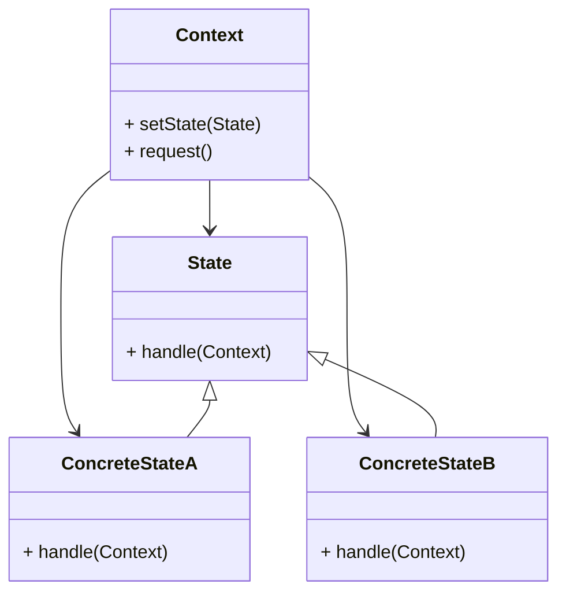

# State Design Pattern
> Version: dp_20231231_234226

- [Builder Design Pattern](#builder-design-pattern)
   * [Summary](#summary)
      + [Essence](#essence)
      + [Real examples](#real-examples)
   * [Implementation](#implementation)
      + [How to use it?](#how-to-use-it)
      + [Python code examples:](#python-code-examples)
   * [Analysis](#analysis)
      + [Cleaner Code?](#cleaner-code)
      + [Readable Code?](#readable-code)
      + [Replaceable code?](#replaceable-code)
      + [Testable code?](#testable-code)
      + [Advantages?](#advantages)
      + [Disadvantages?](#disadvantages)
   * [Remarks](#remarks)
      + [Concerns and Tips?](#concerns-and-tips)
      + [Execrises](#execrises)

## Summary

### Essence
The State design pattern allows an object to alter its behavior when its internal state changes. It encapsulates the behavior of an object into separate state classes, and the object delegates its behavior to the current state. This promotes code modularity, maintainability, loose coupling, and testability. The State design pattern is useful when there are multiple possible states and transitions between them.

### Real examples

- Traffic light system
- Document editor
- Vending machine
- When an object's behavior needs to change based on its internal state
- When there are multiple possible states and transitions between them
- When the behavior of an object can be encapsulated into separate state classes




## Implementation
### How to use it?
To use the State design pattern, follow these steps:
1. Define the context class that will have a reference to the current state object.
2. Define the state interface or abstract class that declares the common methods for all concrete states.
3. Implement concrete state classes that inherit from the state interface or abstract class.
4. In the context class, implement methods to set the current state and delegate the behavior to the current state object.
5. Use the context class to interact with the state objects and change the behavior dynamically.

### Python code examples:
```python
1. Example 1: Traffic light system

```python
from abc import ABC, abstractmethod

class TrafficLightState(ABC):
    @abstractmethod
    def handle(self):
        pass


class RedState(TrafficLightState):
    def handle(self):
        print('Stop')


class YellowState(TrafficLightState):
    def handle(self):
        print('Prepare to stop')


class GreenState(TrafficLightState):
    def handle(self):
        print('Go')


class TrafficLight:
    def __init__(self):
        self.state = RedState()

    def set_state(self, state):
        self.state = state

    def request(self):
        self.state.handle()


traffic_light = TrafficLight()
traffic_light.request()  # Output: Stop
traffic_light.set_state(YellowState())
traffic_light.request()  # Output: Prepare to stop
traffic_light.set_state(GreenState())
traffic_light.request()  # Output: Go
```
2. Example 2: Document editor

```python
from abc import ABC, abstractmethod

class EditingMode(ABC):
    @abstractmethod
    def handle(self):
        pass


class InsertMode(EditingMode):
    def handle(self):
        print('Insert text')


class OverwriteMode(EditingMode):
    def handle(self):
        print('Overwrite text')


class DocumentEditor:
    def __init__(self):
        self.mode = InsertMode()

    def set_mode(self, mode):
        self.mode = mode

    def request(self):
        self.mode.handle()


document_editor = DocumentEditor()
document_editor.request()  # Output: Insert text
document_editor.set_mode(OverwriteMode())
document_editor.request()  # Output: Overwrite text

```

- 1. The State design pattern allows an object to change its behavior when its internal state changes.
- 2. It encapsulates the behavior of an object into separate state classes.
- 3. The behavior of the object is delegated to the current state.
- 4. The State design pattern promotes code modularity, maintainability, loose coupling, and testability.
- 5. It is useful when there are multiple possible states and transitions between them.   


## Analysis
### Maintainability: 
To what extent is your code characterized by cleanliness and readability?
#### Cleaner Code?

- Encapsulates the behavior of an object into separate state classes, leading to a more modular and maintainable codebase.
- Reduces code duplication by implementing common behavior in the base state class or interface.
- Promotes the Single Responsibility Principle (SRP) by separating the behavior into different state classes.

#### Readable Code?

- Improves code readability by clearly defining the different states and their associated behavior.
- Makes the code self-explanatory by delegating the behavior to the current state.


### Testability: 
Can your code be methodically and comprehensively tested?


### Adaptability: 
How readily can your code be substituted or modified?
#### Replaceable code?

- Promotes code replaceability by encapsulating the behavior into separate state classes.
- Allows easy extension of behavior by adding new state classes.


### Scalability:
Are your architectural components characterized by loose coupling?


### Tradeoffs:
#### Advantages?

- Allows easy extension of behavior
- Promotes code modularity and maintainability
- Promotes loose coupling and scalability
- Improves code readability
- Makes the code more testable

#### Disadvantages?

- May lead to a large number of classes
- Can be complex to implement with complex state transitions and dependencies
- May not be suitable for simple cases where behavior does not change based on internal state


## Remarks
### Concerns and Tips?

- Concerns: Potential for a large number of classes, complex state transitions, suitability for simple cases
- Programming tips: Use meaningful names, consider using a state machine library, document state transitions
- Trickys: Design clear and consistent state transitions, avoid excessive dependencies
- Further studies: 'Design Patterns: Elements of Reusable Object-Oriented Software', 'Head First Design Patterns', 'Design Patterns in Python'


### Execrises

- Q: What is the purpose of the State design pattern?

  - A: The purpose of the State design pattern is to allow an object to alter its behavior when its internal state changes.
- Q: How does the State design pattern promote code modularity?

  - A: The State design pattern encapsulates the behavior of an object into separate state classes, which promotes code modularity and maintainability.
- Q: How does the State design pattern help in making the code testable?

  - A: The State design pattern separates the behavior of an object into different state classes, which allows for easier testing of each state in isolation.
- Q: What are some advantages of using the State design pattern?

  - A: Some advantages of using the State design pattern include easy extension of behavior, code modularity, loose coupling, improved code readability, and better testability.
- Q: What are some concerns with the State design pattern?

  - A: Some concerns with the State design pattern include the potential for a large number of classes, complex state transitions, and the suitability for simple cases.

