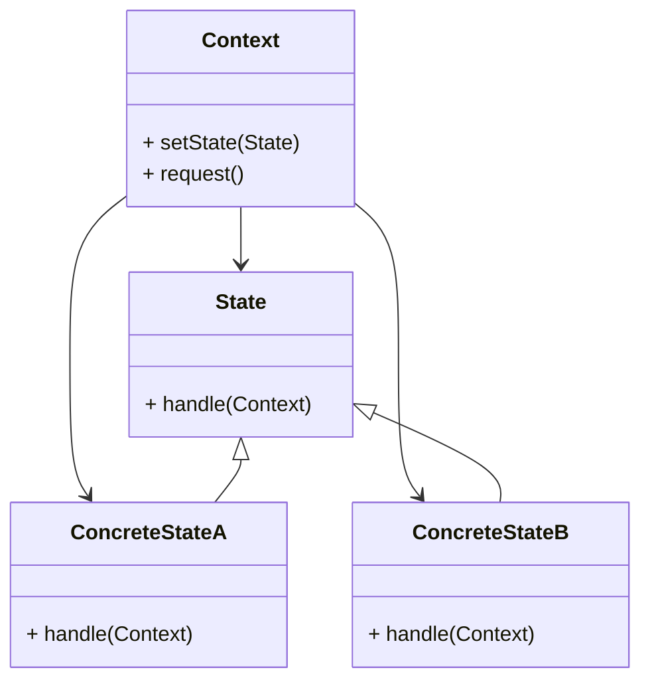

# State Design Pattern
> Version: dp_20231231_202019

- [Builder Design Pattern](#builder-design-pattern)
   * [Summary](#summary)
      + [Essence](#essence)
      + [Real examples](#real-examples)
   * [Implementation](#implementation)
      + [How to use it?](#how-to-use-it)
      + [Python code examples:](#python-code-examples)
   * [Analysis](#analysis)
      + [Cleaner Code?](#cleaner-code)
      + [Readable Code?](#readable-code)
      + [Replaceable code?](#replaceable-code)
      + [Testable code?](#testable-code)
      + [Advantages?](#advantages)
      + [Disadvantages?](#disadvantages)
   * [Remarks](#remarks)
      + [Concerns and Tips?](#concerns-and-tips)
      + [Execrises](#execrises)

## Summary

### Essence

- The State design pattern allows an object to change its behavior based on its internal state.
- It encapsulates the behavior of an object into separate state classes, each responsible for its own behavior.
- The object delegates its behavior to the current state, promoting clean, readable, and testable code.
- This pattern is useful when an object's behavior needs to change based on its internal state, and when there are multiple possible states and transitions between them.

### Real examples

- Traffic light system: Each state of the traffic light (e.g., red, yellow, green) can be represented by a separate state class.
- Document editor: Different editing modes (e.g., insert mode, overwrite mode) can be represented by separate state classes.
- Vending machine: Different states (e.g., idle state, selection state, dispensing state) can be represented by separate state classes.
- The pattern is useful when an object's behavior needs to change based on its internal state, and when there are multiple possible states and transitions between them.




## Implementation
### How to use it?
To use the State design pattern, follow these steps:
1. Define the context class that will have a reference to the current state object.
2. Define the state interface or abstract class that declares the common methods for all concrete states.
3. Implement concrete state classes that inherit from the state interface or abstract class.
4. In the context class, implement methods to set the current state and delegate the behavior to the current state object.
5. Use the context class to interact with the object and let it handle its behavior based on its internal state.

### Python code examples:
```python

from abc import ABC, abstractmethod

class State(ABC):
    @abstractmethod
    def handle(self, context):
        pass


class ConcreteStateA(State):
    def handle(self, context):
        print('Handling state A')


class ConcreteStateB(State):
    def handle(self, context):
        print('Handling state B')


class Context:
    def __init__(self):
        self.state = None

    def set_state(self, state):
        self.state = state

    def request(self):
        self.state.handle(self)


context = Context()
state_a = ConcreteStateA()
state_b = ConcreteStateB()

context.set_state(state_a)
context.request()

context.set_state(state_b)
context.request()

```

- The above Python code demonstrates the State design pattern. The State interface declares a method handle(), which is implemented by the ConcreteStateA and ConcreteStateB classes. The Context class has a reference to the current state object and delegates its behavior to the current state.   


## Analysis
### Cleaner Code?

- The pattern separates the behavior of an object into separate state classes, leading to cleaner and more maintainable code.
- Each state class has a single responsibility, adhering to the single responsibility principle.
- The pattern encapsulates related code into separate state classes, reducing code duplication.

### Readable Code?

- State transitions are explicit and clear, making the code more readable.
- Each state class represents a specific behavior or state of the object, making the code self-explanatory.
- The pattern promotes modularity by encapsulating the behavior of an object into separate state classes, making the code easier to understand and modify.

### Replaceable code?

- The pattern promotes loose coupling by using dependency inversion. The context class depends on the state interface or abstract class, rather than concrete state classes, allowing for easier substitution of different state implementations.
- The pattern adheres to the open-closed principle, as new states can be added without modifying the existing code.
- The pattern separates the behavior of an object into separate state classes, reducing dependencies and making the code more modular and maintainable.

### Testable code?

- Each state class can be tested independently, allowing for more focused and targeted testing.
- The pattern allows for easier mocking of the object's behavior in different states.
- The pattern helps in achieving better test coverage, as each state and state transition can be tested separately.

### Advantages?

- The pattern provides flexibility by allowing an object to change its behavior at runtime based on its internal state.
- The pattern promotes maintainability by encapsulating the behavior of an object into separate state classes.
- The pattern makes the code easier to test, as each state class can be tested independently.
- The pattern helps in solving problems related to changing an object's behavior based on its internal state, managing multiple possible states and transitions between them, and encapsulating the behavior of an object into separate state classes.

### Disadvantages?

- The pattern introduces additional complexity due to the implementation of multiple state classes and managing the state transitions.
- The pattern can introduce some overhead, as each state transition involves delegating the behavior to the current state object.
- If the state transitions are not properly managed, there is a risk of the object being in an inconsistent state.
- The pattern helps in avoiding complex conditional statements and code duplication by encapsulating the behavior of an object into separate state classes.


## Remarks
### Concerns and Tips?

- Concerns: The pattern can introduce additional complexity, especially when there are multiple states and state transitions. It is important to ensure that the object is always in a valid and consistent state. The pattern can introduce some overhead due to the delegation of behavior to the current state object.
- Programming Tips: Design the state classes carefully to ensure that each state has a clear responsibility. Use dependency inversion to decouple the context class from the concrete state classes. Choose the right granularity for the states to balance flexibility and complexity. Implement proper validation and error handling. Test each state and state transition independently. Document the state transitions clearly.
- Tricky Aspects: Managing the state transitions can be tricky. Choosing the right granularity for the states can be challenging. If there is shared state between multiple states, it can be challenging to manage and synchronize the state changes.
- Further Studies: 'Design Patterns: Elements of Reusable Object-Oriented Software' by Erich Gamma et al., 'Head First Design Patterns' by Eric Freeman et al., 'Design Patterns in Python' by Brandon Rhodes and Dusty Phillips.


### Execrises

- 1. Q: What is the purpose of the State design pattern?
   
  - A: The purpose of the State design pattern is to allow an object to alter its behavior when its internal state changes.
- 2. Q: How does the State design pattern promote clean code?
   
  - A: The State design pattern promotes clean code by separating concerns, adhering to the single responsibility principle, and reducing code duplication.
- 3. Q: How does the State design pattern help in making the code readable?
   
  - A: The State design pattern makes the code more readable by making state transitions explicit, self-explanatory, and modular.
- 4. Q: How does the State design pattern help in making the code easy to be tested?
   
  - A: The State design pattern makes the code easier to test by allowing independent testing of each state and state transition.
- 5. Q: How does the State design pattern help in making components loose coupled?
   
  - A: The State design pattern promotes loose coupling by using dependency inversion and adhering to the open-closed principle.
- 6. Q: What are the advantages of using the State design pattern?
   
  - A: The advantages of using the State design pattern include flexibility, maintainability, and testability.
- 7. Q: What are the disadvantages of using the State design pattern?
   
  - A: The disadvantages of using the State design pattern include increased complexity, overhead, and potential for inconsistent states.
- 8. Q: How can the State design pattern be implemented in Python?
   
  - A: The State design pattern can be implemented in Python using interfaces or abstract classes for the state, and separate classes for each concrete state.
- 9. Q: What are some common pitfalls to avoid when using the State design pattern?
   
  - A: Some common pitfalls to avoid include improper management of state transitions, choosing the wrong granularity for states, and handling shared state.
- 10. Q: How can the State design pattern be tested?
    
  - A: The State design pattern can be tested by testing each state and state transition independently, and by mocking the behavior of the states.

