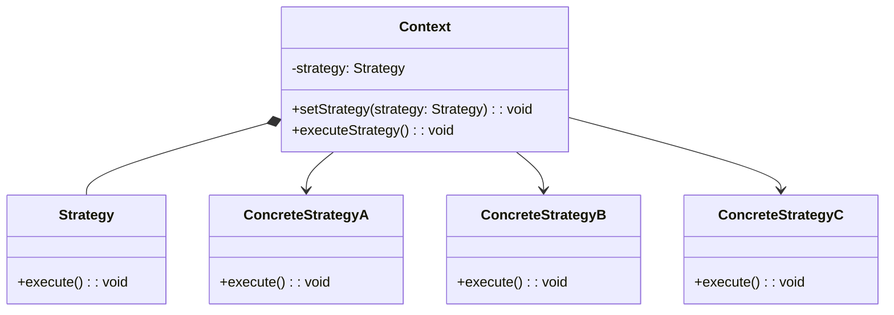

# Strategy Design Pattern
> Version: dp_20231231_234226

- [Builder Design Pattern](#builder-design-pattern)
   * [Summary](#summary)
      + [Essence](#essence)
      + [Real examples](#real-examples)
   * [Implementation](#implementation)
      + [How to use it?](#how-to-use-it)
      + [Python code examples:](#python-code-examples)
   * [Analysis](#analysis)
      + [Cleaner Code?](#cleaner-code)
      + [Readable Code?](#readable-code)
      + [Replaceable code?](#replaceable-code)
      + [Testable code?](#testable-code)
      + [Advantages?](#advantages)
      + [Disadvantages?](#disadvantages)
   * [Remarks](#remarks)
      + [Concerns and Tips?](#concerns-and-tips)
      + [Execrises](#execrises)

## Summary

### Essence
The Strategy design pattern encapsulates related algorithms into separate classes, allowing for easy interchangeability at runtime.

### Real examples

- Sorting algorithms
- Payment methods
- File compression
- Text editor with spell-checking algorithms
- Game with different difficulty levels
- Navigation app with routing algorithms




## Implementation
### How to use it?
To use the Strategy design pattern, follow these steps:
1. Create an interface or abstract class that defines the common methods for all strategies.
2. Implement concrete classes that inherit from the interface or abstract class, representing different strategies.
3. Create a context class that has a reference to the strategy interface or abstract class.
4. In the context class, provide methods to set and execute the strategy.
5. Use the context class to dynamically change the strategy at runtime.

### Python code examples:
```python
from abc import ABC, abstractmethod

class Strategy(ABC):
    @abstractmethod
    def execute(self):
        pass


class ConcreteStrategyA(Strategy):
    def execute(self):
        print('Executing strategy A')


class ConcreteStrategyB(Strategy):
    def execute(self):
        print('Executing strategy B')


class Context:
    def __init__(self, strategy: Strategy):
        self.strategy = strategy

    def set_strategy(self, strategy: Strategy):
        self.strategy = strategy

    def execute_strategy(self):
        self.strategy.execute()


# Usage
strategy_a = ConcreteStrategyA()
strategy_b = ConcreteStrategyB()

context = Context(strategy_a)
context.execute_strategy()

context.set_strategy(strategy_b)
context.execute_strategy()
```
The code defines a Strategy interface and two concrete strategies. The Context class uses a strategy and can switch between strategies at runtime.   


## Analysis
### Maintainability: 
To what extent is your code characterized by cleanliness and readability?
#### Cleaner Code?
Encapsulates each algorithm into a separate class, improving organization and separation of concerns.

#### Readable Code?
Provides clear separation between the context and the strategies, enhancing code comprehension and modifiability.


### Testability: 
Can your code be methodically and comprehensively tested?


### Adaptability: 
How readily can your code be substituted or modified?
#### Replaceable code?
Allows for easy interchangeability of strategies at runtime, enabling the addition or removal of strategies without modifying the context class.


### Scalability:
Are your architectural components characterized by loose coupling?


### Tradeoffs:
#### Advantages?

- Encapsulates algorithms into separate classes, improving code organization and modifiability.
- Allows for runtime interchangeability of strategies, providing flexibility and adaptability.
- Promotes code reuse by enabling multiple classes to use the same set of strategies.
- Enhances maintainability by separating algorithms from client code.
- Improves testability by enabling independent testing of each strategy.

#### Disadvantages?

- Introduces additional classes and complexity to the codebase.
- Requires knowledge of all available strategies.
- May introduce a slight performance overhead due to method call indirection.


## Remarks
### Concerns and Tips?

- Consider the trade-offs between flexibility and complexity when deciding on the granularity of strategies.
- Use dependency injection to provide the context class with the appropriate strategy.
- Be aware of potential performance impact and mitigate it through proper design and optimization techniques.
- The Strategy design pattern is discussed in 'Design Patterns: Elements of Reusable Object-Oriented Software' by Erich Gamma et al., 'Head First Design Patterns' by Eric Freeman et al., and 'Design Patterns in Python' by Brandon Rhodes et al.


### Execrises

- Q: What is the purpose of the Strategy design pattern?

  - A: The purpose of the Strategy design pattern is to define a family of algorithms, encapsulate each one as a separate class, and make them interchangeable.
- Q: How does the Strategy design pattern improve code maintainability?

  - A: The Strategy design pattern improves code maintainability by separating the algorithms from the client code, making it easier to modify and extend the system.
- Q: Can you explain the difference between the Strategy and the Template Method design patterns?

  - A: The Strategy design pattern focuses on encapsulating algorithms and allowing them to be interchanged at runtime, while the Template Method design pattern focuses on defining the skeleton of an algorithm and allowing subclasses to provide specific implementations.
- Q: How can you test the individual strategies in the Strategy design pattern?

  - A: Each strategy can be tested independently by creating instances of the strategy classes and calling their execute methods.
- Q: What are some potential drawbacks of using the Strategy design pattern?

  - A: Some potential drawbacks include increased complexity due to the introduction of additional classes, the need for the client code to be aware of all available strategies, and a potential performance impact due to the indirection of method calls.

