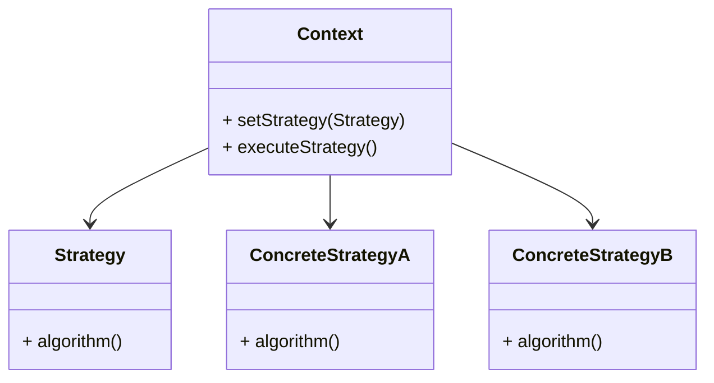

# Strategy Design Pattern
> Version: dp_20231231_202019

- [Builder Design Pattern](#builder-design-pattern)
   * [Summary](#summary)
      + [Essence](#essence)
      + [Real examples](#real-examples)
   * [Implementation](#implementation)
      + [How to use it?](#how-to-use-it)
      + [Python code examples:](#python-code-examples)
   * [Analysis](#analysis)
      + [Cleaner Code?](#cleaner-code)
      + [Readable Code?](#readable-code)
      + [Replaceable code?](#replaceable-code)
      + [Testable code?](#testable-code)
      + [Advantages?](#advantages)
      + [Disadvantages?](#disadvantages)
   * [Remarks](#remarks)
      + [Concerns and Tips?](#concerns-and-tips)
      + [Execrises](#execrises)

## Summary

### Essence
The Strategy design pattern encapsulates related algorithms into separate classes, allowing for easy interchangeability at runtime.

### Real examples

- Sorting algorithms
- Payment methods
- File compression




## Implementation
### How to use it?
To use the Strategy design pattern, follow these steps:
1. Create an interface or abstract class that defines the common methods for all strategies.
2. Implement concrete classes that inherit from the interface or abstract class, representing different strategies.
3. Create a context class that has a reference to the strategy interface or abstract class.
4. In the context class, provide methods to set and execute the strategy.
5. Use the context class to switch between different strategies at runtime.

### Python code examples:
```python
from abc import ABC, abstractmethod

class Strategy(ABC):
    @abstractmethod
    def algorithm(self):
        pass


class ConcreteStrategyA(Strategy):
    def algorithm(self):
        print('Executing algorithm A')


class ConcreteStrategyB(Strategy):
    def algorithm(self):
        print('Executing algorithm B')


class Context:
    def __init__(self, strategy: Strategy):
        self.strategy = strategy

    def set_strategy(self, strategy: Strategy):
        self.strategy = strategy

    def execute_strategy(self):
        self.strategy.algorithm()


# Usage
strategy_a = ConcreteStrategyA()
strategy_b = ConcreteStrategyB()

context = Context(strategy_a)
context.execute_strategy()

context.set_strategy(strategy_b)
context.execute_strategy()
```
The code defines a Strategy interface and two concrete strategies (ConcreteStrategyA and ConcreteStrategyB). The Context class has a reference to the strategy and can switch between different strategies at runtime.   


## Analysis
### Cleaner Code?
Encapsulates each algorithm in a separate class, improving organization and separation of concerns. Promotes code reusability and modularity.

### Readable Code?
Provides a clear and explicit way to switch between algorithms, improving code readability and maintainability.

### Replaceable code?
Promotes loose coupling between client code and algorithms, allowing for easy replacement of algorithms at runtime.

### Testable code?
Allows for independent testing of each algorithm, improving overall testability.

### Advantages?

- Improved code organization and separation of concerns
- Easy interchangeability of algorithms at runtime
- Promotes code reusability and modularity

### Disadvantages?

- Increased complexity due to multiple classes
- Overhead of managing multiple objects


## Remarks
### Concerns and Tips?

- Consider performance impact of dynamically switching between strategies
- Manage creation and lifecycle of strategy objects
- Use meaningful names for strategy classes
- Consider trade-offs between flexibility and performance


### Execrises

- Q: What is the purpose of the Strategy design pattern?

  - A: The purpose of the Strategy design pattern is to define a family of algorithms, encapsulate each one as a separate class, and make them interchangeable.
- Q: How does the Strategy design pattern promote code reusability?

  - A: The Strategy design pattern encapsulates each algorithm in a separate class, making it easier to reuse and modify without affecting other parts of the code.
- Q: Can you explain the difference between the Strategy and Template Method design patterns?

  - A: The Strategy design pattern focuses on encapsulating algorithms and allowing them to be interchanged, while the Template Method design pattern focuses on defining the skeleton of an algorithm and allowing subclasses to provide specific implementations for certain steps.
- Q: When would you use the Strategy design pattern?

  - A: The Strategy design pattern is useful when you have multiple algorithms that can be used interchangeably or when you want to isolate the implementation details of an algorithm from the client code.
- Q: What are the advantages of using the Strategy design pattern?

  - A: The advantages of using the Strategy design pattern include improved code organization, easy interchangeability of algorithms, code reusability, enhanced code readability, and loose coupling between components.
- Q: What are the potential disadvantages of using the Strategy design pattern?

  - A: The potential disadvantages of using the Strategy design pattern include increased complexity, overhead of managing multiple objects, and potential performance impact due to the dynamic nature of the pattern.

