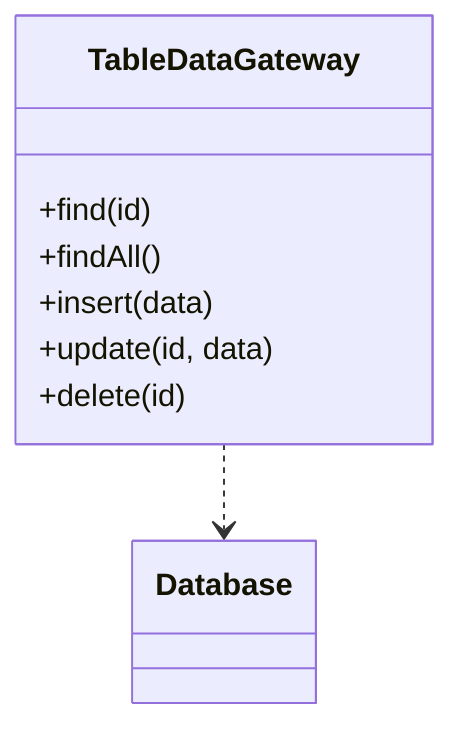

# Table Data Gateway
> Version: dp_20231231_202019

- [Builder Design Pattern](#builder-design-pattern)
   * [Summary](#summary)
      + [Essence](#essence)
      + [Real examples](#real-examples)
   * [Implementation](#implementation)
      + [How to use it?](#how-to-use-it)
      + [Python code examples:](#python-code-examples)
   * [Analysis](#analysis)
      + [Cleaner Code?](#cleaner-code)
      + [Readable Code?](#readable-code)
      + [Replaceable code?](#replaceable-code)
      + [Testable code?](#testable-code)
      + [Advantages?](#advantages)
      + [Disadvantages?](#disadvantages)
   * [Remarks](#remarks)
      + [Concerns and Tips?](#concerns-and-tips)
      + [Execrises](#execrises)

## Summary

### Essence
The Table Data Gateway design pattern centralizes all the database operations for a specific table in a single class. It provides methods for querying, inserting, updating, and deleting data in the table. This pattern helps in making the code clean, readable, and easy to test. It promotes loose coupling and modularity by separating the database logic from the rest of the application. It simplifies the code by providing a clear and consistent interface for interacting with the database.

### Real examples

- In an e-commerce application, handling all database operations related to the 'products' table
- In a customer relationship management (CRM) system, managing the 'contacts' table
- Retrieving a single record from a table
- Retrieving all records from a table
- Inserting a new record into a table
- Updating an existing record in a table
- Deleting a record from a table




## Implementation
### How to use it?
To use the Table Data Gateway design pattern, you need to create a class that represents the table in the database. This class should have methods for querying, inserting, updating, and deleting data in the table. You can then use this class in your application to interact with the database.

### Python code examples:
```python
class ProductTableDataGateway:
    def find(self, id):
        # Database query to find a product by ID
        pass

    def findAll(self):
        # Database query to find all products
        pass

    def insert(self, data):
        # Database query to insert a new product
        pass

    def update(self, id, data):
        # Database query to update a product
        pass

    def delete(self, id):
        # Database query to delete a product
        pass
```
   


## Analysis
### Cleaner Code?

- Encapsulates all the database operations related to a specific table in a single class
- Improves code organization and maintainability
- Promotes the Single Responsibility Principle

### Readable Code?

- Centralizes all the database operations for a specific table in a single class
- Provides a clear and consistent interface for interacting with the database
- Eliminates the need to scatter database queries throughout the codebase

### Replaceable code?

- Encapsulates all the database operations for a specific table in a single class
- Allows for easy switching to a different database or ORM tool
- Reduces dependencies between the application and the database

### Testable code?

- Provides a clear separation between application logic and database operations
- Allows for easy mocking and stubbing of database operations
- Promotes the use of dependency injection

### Advantages?

- Simplifies the code
- Improves code organization and maintainability
- Promotes code reusability and modularity
- Makes the code more readable and easier to understand
- Facilitates unit testing
- Helps in making components loose coupled and easily replaceable
- Provides a clear and consistent interface for interacting with the database

### Disadvantages?

- May introduce an additional layer of abstraction
- Requires creating a separate Table Data Gateway class for each table
- May not be suitable for complex database operations
- Can be less efficient for certain use cases


## Remarks
### Concerns and Tips?

- The Table Data Gateway design pattern may introduce complexity
- Creating separate Table Data Gateway classes can be time-consuming
- Consider using a database abstraction layer or ORM tool
- Avoid mixing business logic with database operations


### Execrises

- Q: What is the purpose of the Table Data Gateway design pattern?

  - A: The purpose of the Table Data Gateway design pattern is to provide a way to access and manipulate data in a database table.
- Q: How does the Table Data Gateway design pattern help in making the code clean?

  - A: The Table Data Gateway design pattern helps in making the code clean by encapsulating all the database operations related to a specific table in a single class.
- Q: How does the Table Data Gateway design pattern promote loose coupling?

  - A: The Table Data Gateway design pattern promotes loose coupling by encapsulating all the database operations for a specific table in a single class and providing a well-defined interface for interacting with the database.
- Q: What are the advantages of using the Table Data Gateway design pattern?

  - A: Some advantages of using the Table Data Gateway design pattern include simplifying the code, improving code organization and maintainability, promoting code reusability and modularity, and facilitating unit testing.
- Q: What are some concerns or disadvantages of using the Table Data Gateway design pattern?

  - A: Some concerns or disadvantages of using the Table Data Gateway design pattern include increased complexity, the need to create a separate Table Data Gateway class for each table in the database, and potential inefficiency for certain use cases.
- Q: How can the Table Data Gateway design pattern be tested?

  - A: The Table Data Gateway design pattern can be tested by mocking or stubbing the database operations in the Table Data Gateway class and writing unit tests for the application logic that interacts with the Table Data Gateway.

