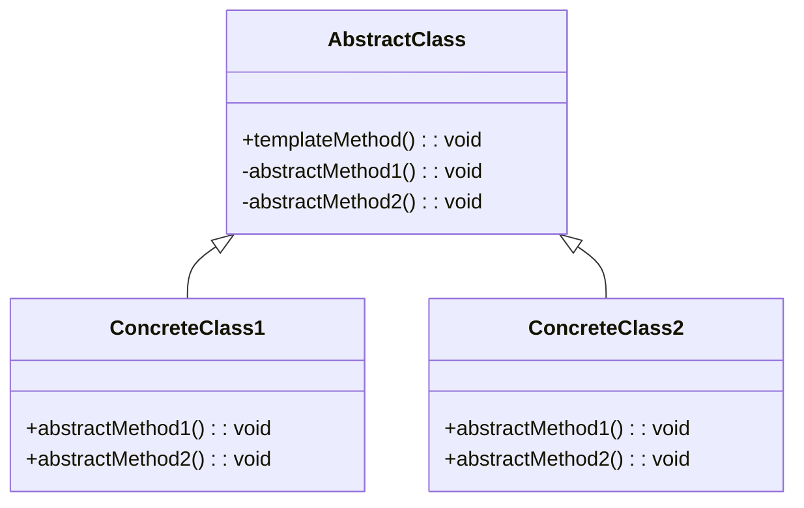

# Template Method
> Version: dp_20231231_234226

- [Builder Design Pattern](#builder-design-pattern)
   * [Summary](#summary)
      + [Essence](#essence)
      + [Real examples](#real-examples)
   * [Implementation](#implementation)
      + [How to use it?](#how-to-use-it)
      + [Python code examples:](#python-code-examples)
   * [Analysis](#analysis)
      + [Cleaner Code?](#cleaner-code)
      + [Readable Code?](#readable-code)
      + [Replaceable code?](#replaceable-code)
      + [Testable code?](#testable-code)
      + [Advantages?](#advantages)
      + [Disadvantages?](#disadvantages)
   * [Remarks](#remarks)
      + [Concerns and Tips?](#concerns-and-tips)
      + [Execrises](#execrises)

## Summary

### Essence
The Template Method design pattern defines a common algorithm structure in a base class while allowing subclasses to customize certain steps of the algorithm. It promotes code reuse, maintainability, and scalability.

### Real examples

- When defining a common algorithm structure with customizable steps
- To avoid code duplication by moving common code to a base class
- To provide a way for clients to customize the behavior of an algorithm without modifying its structure




## Implementation
### How to use it?
To use the Template Method design pattern, follow these steps:
1. Create an abstract base class that defines the template method and declares abstract methods for the customizable steps.
2. Create concrete subclasses that inherit from the base class and implement the abstract methods.
3. The template method in the base class should call the abstract methods in the appropriate order to execute the algorithm.

### Python code examples:
```python

from abc import ABC, abstractmethod

class AbstractClass(ABC):

    def template_method(self):
        self.step1()
        self.step2()

    @abstractmethod
    def step1(self):
        pass

    @abstractmethod
    def step2(self):
        pass


class ConcreteClass1(AbstractClass):

    def step1(self):
        print('ConcreteClass1: Step 1')

    def step2(self):
        print('ConcreteClass1: Step 2')


class ConcreteClass2(AbstractClass):

    def step1(self):
        print('ConcreteClass2: Step 1')

    def step2(self):
        print('ConcreteClass2: Step 2')


if __name__ == '__main__':
    concrete1 = ConcreteClass1()
    concrete1.template_method()

    concrete2 = ConcreteClass2()
    concrete2.template_method()

```

- The Python code example demonstrates the Template Method design pattern. The AbstractClass defines the template method and declares abstract methods for the customizable steps. The ConcreteClass1 and ConcreteClass2 provide specific implementations for the steps and call the template method to execute the algorithm.   


## Analysis
### Maintainability: 
To what extent is your code characterized by cleanliness and readability?
#### Cleaner Code?

- Promotes code reuse by defining a common algorithm structure in a base class
- Reduces code duplication by separating the common algorithm from specific implementations
- Encapsulates common behavior in a single place, making the code more modular and organized

#### Readable Code?

- Provides a clear structure for the algorithm, making the code more readable
- Separates the core algorithm from specific implementation details
- Uses meaningful method names, improving code readability and understandability


### Testability: 
Can your code be methodically and comprehensively tested?


### Adaptability: 
How readily can your code be substituted or modified?
#### Replaceable code?

- Allows subclasses to provide different implementations for certain steps of the algorithm
- Promotes loose coupling between the base class and its subclasses
- Enables easy replacement or extension of behavior without affecting other parts of the code


### Scalability:
Are your architectural components characterized by loose coupling?


### Tradeoffs:
#### Advantages?

- Promotes code reuse, maintainability, and scalability
- Provides flexibility through customizable steps of the algorithm
- Encapsulates behavior, making the code more modular and organized
- Allows easy addition of new subclasses and accommodates future changes

#### Disadvantages?

- May not be suitable for highly flexible algorithms with varying steps
- Introduces complexity with inheritance and abstract methods
- May not provide enough flexibility for highly customized algorithms


## Remarks
### Concerns and Tips?

- Consider the level of abstraction for the base class to balance usefulness and flexibility
- Manage dependencies between the base class and its subclasses
- Document and communicate the base class and its subclasses to other developers
- Use meaningful method names, consider dependency injection, and document purpose and behavior


### Execrises

- Q: What is the purpose of the Template Method design pattern?

  - A: The purpose of the Template Method design pattern is to define the skeleton of an algorithm in a base class and allow subclasses to provide specific implementations for certain steps of the algorithm.

Q: How does the Template Method design pattern promote code reuse?

  - A: The Template Method design pattern promotes code reuse by defining a common algorithm structure in a base class, reducing code duplication.

Q: How does the Template Method design pattern help in making the code testable?

  - A: The Template Method design pattern helps in making the code testable by separating the core algorithm from the specific implementation details, allowing for the creation of testable units that can be tested in isolation.

