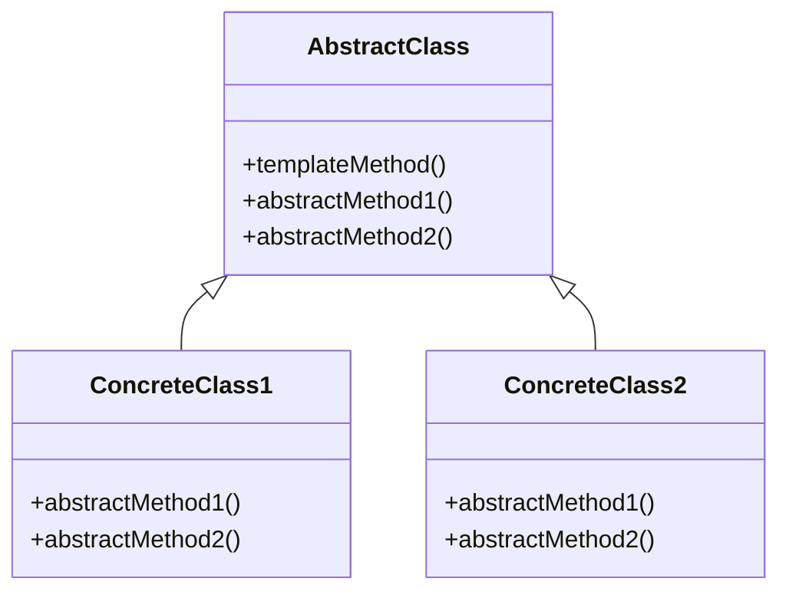

# Template Method
> Version: dp_20231231_202019

- [Builder Design Pattern](#builder-design-pattern)
   * [Summary](#summary)
      + [Essence](#essence)
      + [Real examples](#real-examples)
   * [Implementation](#implementation)
      + [How to use it?](#how-to-use-it)
      + [Python code examples:](#python-code-examples)
   * [Analysis](#analysis)
      + [Cleaner Code?](#cleaner-code)
      + [Readable Code?](#readable-code)
      + [Replaceable code?](#replaceable-code)
      + [Testable code?](#testable-code)
      + [Advantages?](#advantages)
      + [Disadvantages?](#disadvantages)
   * [Remarks](#remarks)
      + [Concerns and Tips?](#concerns-and-tips)
      + [Execrises](#execrises)

## Summary

### Essence
The Template Method design pattern defines a common structure for an algorithm in a base class and allows subclasses to provide specific implementations for certain steps without changing the overall structure. It promotes code reuse and reduces code duplication by extracting common code into the base class. The template method acts as a high-level overview of the algorithm, while the abstract methods provide specific details that can be easily understood by reading the concrete implementations in the subclasses. This design pattern helps in making code clean, readable, and easy to test.

### Real examples

- When you want to define a common algorithm or process that can be shared among multiple subclasses, but still allow for variation in certain steps of the algorithm.
- When you want to avoid code duplication by extracting common code into a base class and allowing subclasses to provide specific implementations for certain steps.
- When you want to enforce a specific structure or sequence of steps in an algorithm, while still allowing for customization of individual steps.




## Implementation
### How to use it?
To use the Template Method design pattern, follow these steps:
1. Create an abstract base class that defines the template method and declares abstract methods for the customizable steps.
2. Create concrete subclasses that inherit from the base class and provide implementations for the abstract methods.
3. Use the template method in client code to execute the algorithm, relying on the concrete subclasses to provide the specific behavior for the abstract steps.

### Python code examples:
```python
from abc import ABC, abstractmethod

class AbstractClass(ABC):

    def template_method(self):
        self.step1()
        self.step2()
        self.step3()

    @abstractmethod
    def step1(self):
        pass

    @abstractmethod
    def step2(self):
        pass

    @abstractmethod
    def step3(self):
        pass


class ConcreteClass(AbstractClass):

    def step1(self):
        print('ConcreteClass: Step 1')

    def step2(self):
        print('ConcreteClass: Step 2')

    def step3(self):
        print('ConcreteClass: Step 3')


if __name__ == '__main__':
    concrete = ConcreteClass()
    concrete.template_method()
```
The above Python code demonstrates the Template Method design pattern. The AbstractClass defines the template method and declares abstract methods for the customizable steps. The ConcreteClass provides concrete implementations for these steps and uses the template method to execute the algorithm.   


## Analysis
### Cleaner Code?
Promotes code reuse and reduces code duplication by extracting common code into the base class.

### Readable Code?
Provides a clear and consistent structure for the algorithm, making the code more readable and easier to understand.

### Replaceable code?
Separates the high-level algorithm from the specific implementations of its steps, making components loosely coupled.

### Testable code?
Allows for easier isolation of specific steps in the algorithm, making it easier to test each step in isolation by providing mock implementations.

### Advantages?

- Promotes code reuse and reduces code duplication.
- Provides a clear and consistent structure for the algorithm.
- Makes code clean, readable, and easy to test.
- Helps in making components loosely coupled.

### Disadvantages?

- Limited flexibility compared to other design patterns.
- Increased complexity due to the use of abstract methods and subclasses.
- Inheritance limitations may limit the flexibility and extensibility of the codebase.


## Remarks
### Concerns and Tips?

- One concern is the potential for a large number of subclasses if there are many variations of the algorithm.
- Another concern is the reliance on inheritance to define the structure and variations of the algorithm.
- The use of abstract methods and subclasses can introduce additional complexity to the codebase.
- The Template Method design pattern may not be suitable for all types of algorithms.


### Execrises

- Q: What is the purpose of the Template Method design pattern?

  - A: The purpose of the Template Method design pattern is to define a common structure for an algorithm in a base class and allow subclasses to provide specific implementations for certain steps of the algorithm without changing its structure.
- Q: How does the Template Method design pattern promote code reuse?

  - A: The Template Method design pattern promotes code reuse by providing a common structure that can be shared among multiple subclasses. The base class defines the overall structure of the algorithm, while the concrete subclasses provide the specific implementations for each step.
- Q: How does the Template Method design pattern help in making code clean?

  - A: The Template Method design pattern helps in making code clean by promoting code reuse and reducing code duplication. It provides a clear and consistent structure for the algorithm, eliminating the need for duplicate code in each subclass.
- Q: How does the Template Method design pattern help in making code readable?

  - A: The Template Method design pattern helps in making code readable by providing a clear and consistent structure for the algorithm. The template method acts as a high-level overview of the algorithm, while the abstract methods provide specific details that can be easily understood by reading the concrete implementations in the subclasses.
- Q: How does the Template Method design pattern help in making code easy to be tested?

  - A: The Template Method design pattern helps in making code easy to be tested by allowing for easier isolation of specific steps in the algorithm. The abstract methods represent individual steps that can be overridden in the subclasses, making it easier to test each step in isolation by providing mock implementations.
- Q: How does the Template Method design pattern help in making components loose coupled?

  - A: The Template Method design pattern helps in making components loosely coupled by separating the high-level algorithm from the specific implementations of its steps. The base class defines the overall structure of the algorithm, while the concrete subclasses provide the specific implementations. This separation allows for independent development and modification of the subclasses without affecting the overall algorithm or other subclasses.

