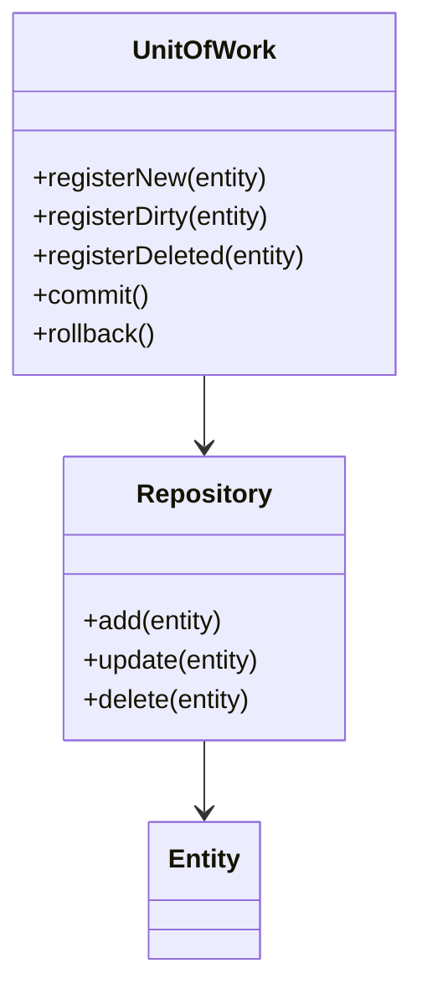

# Unit of Work
> Version: dp_20231231_202019

- [Builder Design Pattern](#builder-design-pattern)
   * [Summary](#summary)
      + [Essence](#essence)
      + [Real examples](#real-examples)
   * [Implementation](#implementation)
      + [How to use it?](#how-to-use-it)
      + [Python code examples:](#python-code-examples)
   * [Analysis](#analysis)
      + [Cleaner Code?](#cleaner-code)
      + [Readable Code?](#readable-code)
      + [Replaceable code?](#replaceable-code)
      + [Testable code?](#testable-code)
      + [Advantages?](#advantages)
      + [Disadvantages?](#disadvantages)
   * [Remarks](#remarks)
      + [Concerns and Tips?](#concerns-and-tips)
      + [Execrises](#execrises)

## Summary

### Essence
Encapsulates a set of related operations into a single transaction, ensuring all operations succeed or fail together

### Real examples

- Managing complex business transactions
- Coordinating and tracking related operations within a single transaction
- Ensuring all operations succeed or fail together

## Implementation
### How to use it?
To use the Unit of Work design pattern, follow these steps:
1. Create a UnitOfWork class that provides methods for registering new, dirty, and deleted entities, as well as committing and rolling back the transaction.
2. Create Repository classes that provide methods for adding, updating, and deleting entities.
3. Use the UnitOfWork and Repository classes to coordinate and track related operations within a single transaction.

## Analysis
### Cleaner Code?

- Encapsulates related operations into a single transaction
- Improves code readability and maintainability
- Separates concerns of data access and transaction management

### Readable Code?

- Provides a clear and consistent way to manage and track related operations within a single transaction
- Separates concerns of data access and transaction management

### Replaceable code?

- Enables loose coupling between components
- Separates concerns of data access and transaction management

### Testable code?

- Provides a clear and consistent way to manage and track related operations within a single transaction
- Allows for easier mocking and stubbing of data access and transaction management components

### Advantages?

- Simplifies the management and coordination of related operations
- Improves code readability and maintainability
- Enables easier testing and mocking of components
- Promotes loose coupling between components

### Disadvantages?

- Introduces additional complexity and overhead
- Requires careful design and implementation
- May not be suitable for all applications or use cases

## Remarks
### Concerns and Tips?

- Additional complexity and overhead
- Concurrency and consistency issues
- Suitability for different applications and use cases
- Careful design and implementation required
- Use appropriate transaction management mechanisms

### Execrises

- 1. What is the purpose of the Unit of Work design pattern?
- The purpose of the Unit of Work design pattern is to manage the coordination and tracking of multiple related operations within a single transaction.
- 2. How does the Unit of Work design pattern help in making code clean?
- The Unit of Work design pattern helps in making clean code by encapsulating related operations into a single transaction, separating the concerns of data access and transaction management, and improving code readability and maintainability.
- 3. What are the advantages of using the Unit of Work design pattern?
- The advantages of using the Unit of Work design pattern include simplifying the management and coordination of related operations, improving code readability and maintainability, enabling easier testing and mocking, and promoting loose coupling between components.
- 4. What are the disadvantages of using the Unit of Work design pattern?
- The disadvantages of using the Unit of Work design pattern include introducing additional complexity and overhead, requiring careful design and implementation to handle concurrency and consistency issues, and potential unsuitability for certain types of applications or use cases.

