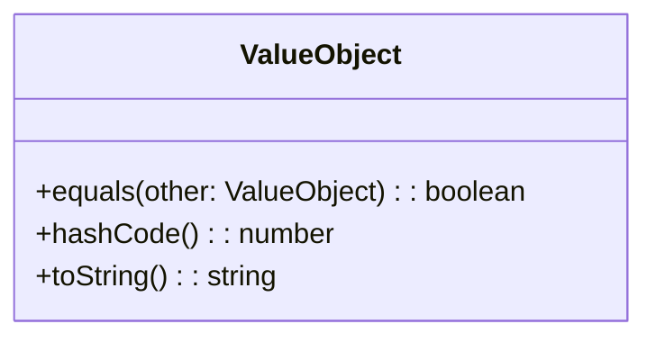

# Value Object
> Version: dp_20231231_202019

- [Builder Design Pattern](#builder-design-pattern)
   * [Summary](#summary)
      + [Essence](#essence)
      + [Real examples](#real-examples)
   * [Implementation](#implementation)
      + [How to use it?](#how-to-use-it)
      + [Python code examples:](#python-code-examples)
   * [Analysis](#analysis)
      + [Cleaner Code?](#cleaner-code)
      + [Readable Code?](#readable-code)
      + [Replaceable code?](#replaceable-code)
      + [Testable code?](#testable-code)
      + [Advantages?](#advantages)
      + [Disadvantages?](#disadvantages)
   * [Remarks](#remarks)
      + [Concerns and Tips?](#concerns-and-tips)
      + [Execrises](#execrises)

## Summary

### Essence
The Value Object design pattern represents a value or concept in the domain model. It encapsulates data and behavior, ensuring immutability and allowing comparison based on values.

### Real examples

- Comparing values
- Immutable data
- Value-based collections
- Domain modeling




## Implementation
### How to use it?
To use the Value Object design pattern, follow these steps:
1. Identify a value or concept in the domain model that can be represented as an immutable object.
2. Define a class for the value object, encapsulating the data and behavior related to that value or concept.
3. Implement the equals() method to compare two value objects based on their values.
4. Implement the hashCode() method to generate a hash code based on the values of the object.
5. Implement the toString() method to provide a string representation of the value object.

### Python code examples:
```python
class Money:
    def __init__(self, currency: str, amount: float):
        self.currency = currency
        self.amount = amount

    def __eq__(self, other):
        if isinstance(other, Money):
            return self.currency == other.currency and self.amount == other.amount
        return False

    def __hash__(self):
        return hash((self.currency, self.amount))

    def __str__(self):
        return f'{self.currency} {self.amount}'
class Date:
    def __init__(self, year: int, month: int, day: int):
        self.year = year
        self.month = month
        self.day = day

    def __eq__(self, other):
        if isinstance(other, Date):
            return self.year == other.year and self.month == other.month and self.day == other.day
        return False

    def __hash__(self):
        return hash((self.year, self.month, self.day))

    def __str__(self):
        return f'{self.year}-{self.month}-{self.day}'
```

- The Python code examples demonstrate the implementation of value objects for Money and Date. They define the equals(), hashCode(), and toString() methods to provide value-based comparisons and string representations.   


## Analysis
### Cleaner Code?

- Encapsulation: Value objects encapsulate data and behavior, making the code modular and organized.
- Immutability: Value objects are immutable, eliminating the need for defensive copying and reducing the risk of bugs.
- Single responsibility: Value objects have a single responsibility, adhering to the Single Responsibility Principle.
- Readability: Value objects have clear and meaningful names, improving code readability.
- Reusability: Value objects can be reused, reducing duplication and promoting code reuse.

### Readable Code?

- Clear intent: Value objects have clear and meaningful names, making the code self-explanatory.
- Self-contained: Value objects encapsulate data and behavior, making the code modular and easier to understand.
- Expressive domain modeling: Value objects represent concepts in the domain model, improving code expressiveness.
- Consistent usage: Value objects follow a consistent pattern, making them easier to understand and use correctly.

### Replaceable code?

- Loose coupling: Value objects are self-contained and can be easily replaced or extended without affecting the rest of the codebase.

### Testable code?

- Deterministic behavior: Value objects have deterministic behavior, making tests predictable.
- Easy comparison: Value objects can be compared based on values, facilitating correctness verification.
- Isolation: Value objects are self-contained, making them easier to isolate for testing.
- Test data generation: Value objects can be easily created with specific values, aiding test data generation.

### Advantages?

- Immutability ensures data integrity and prevents accidental modifications.
- Easy value-based comparisons.
- Efficient lookup and retrieval in collections.
- Promotes clean and modular code.
- Code reuse.

### Disadvantages?

- Increased memory usage.
- Potential performance impact for large collections.
- Increased complexity compared to simple data types.


## Remarks
### Concerns and Tips?

- Memory usage, performance, and complexity are concerns when using value objects.
- Tips: Keep value objects simple and focused, ensure immutability, implement value-based comparisons, use them for domain modeling, and promote code reuse.
- Trickys: Ensuring immutability, implementing value-based comparisons, handling complex value objects.


### Execrises

- Q: What is the purpose of the Value Object design pattern?

  - A: The purpose of the Value Object design pattern is to represent a value or a concept in the domain model in an immutable way.
- Q: How does the Value Object design pattern help in making the code clean?

  - A: The Value Object design pattern promotes clean code by encapsulating the data and behavior related to a specific value or concept, ensuring immutability, and following the Single Responsibility Principle.
- Q: How can value objects be compared?

  - A: Value objects can be compared based on their values using the equals() method.
- Q: What are the advantages of using value objects?

  - A: The advantages of using value objects include data integrity, easy value-based comparisons, efficient lookup and retrieval in collections, clean and modular code, and code reuse.
- Q: What are some concerns or disadvantages of using value objects?

  - A: Some concerns or disadvantages of using value objects include increased memory usage, potential performance impact for large collections, and increased complexity compared to simple data types.

