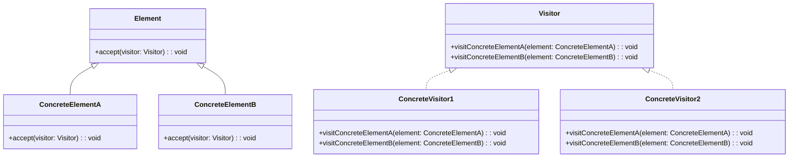

# Visitor Design Pattern
> Version: dp_20231231_234226

- [Builder Design Pattern](#builder-design-pattern)
   * [Summary](#summary)
      + [Essence](#essence)
      + [Real examples](#real-examples)
   * [Implementation](#implementation)
      + [How to use it?](#how-to-use-it)
      + [Python code examples:](#python-code-examples)
   * [Analysis](#analysis)
      + [Cleaner Code?](#cleaner-code)
      + [Readable Code?](#readable-code)
      + [Replaceable code?](#replaceable-code)
      + [Testable code?](#testable-code)
      + [Advantages?](#advantages)
      + [Disadvantages?](#disadvantages)
   * [Remarks](#remarks)
      + [Concerns and Tips?](#concerns-and-tips)
      + [Execrises](#execrises)

## Summary

### Essence

- Visitor pattern separates the algorithm from the objects it operates on, allowing new operations to be added without modifying the object structures.
- It uses double dispatch to determine the operation based on the combination of the element's type and the visitor's type.
- This pattern promotes clean code by encapsulating related operations in separate visitor classes.
- Visitor pattern helps in making the code readable, clean, replaceable, testable, and scalable.

### Real examples

- Visitor pattern is used in compilers to perform different operations on the abstract syntax tree nodes, such as type checking, code generation, or optimization.
- In a GUI framework, it can be used to traverse the object hierarchy and perform operations on different types of UI elements, such as rendering, event handling, or layout calculations.
- It is useful when adding new operations to existing object structures without modifying those structures.
- It is beneficial when separating the algorithm from the objects on which it operates.
- Visitor pattern is effective when performing different operations on a collection of objects based on their types.




## Implementation
### How to use it?
To use the Visitor design pattern:
1. Define the Element interface or abstract class that declares the accept method.
2. Implement the Element interface or class in concrete element classes.
3. Define the Visitor interface or abstract class that declares visit methods for each concrete element.
4. Implement the Visitor interface or class in concrete visitor classes.
5. In the client code, create instances of the concrete elements and the concrete visitor(s), and call the accept method on the elements, passing the visitor(s) as arguments.

### Python code examples:
```python
from abc import ABC, abstractmethod

class Element(ABC):
    @abstractmethod
    def accept(self, visitor):
        pass


class ConcreteElementA(Element):
    def accept(self, visitor):
        visitor.visit_concrete_element_a(self)


class ConcreteElementB(Element):
    def accept(self, visitor):
        visitor.visit_concrete_element_b(self)


class Visitor(ABC):
    @abstractmethod
    def visit_concrete_element_a(self, element):
        pass

    @abstractmethod
    def visit_concrete_element_b(self, element):
        pass


class ConcreteVisitor1(Visitor):
    def visit_concrete_element_a(self, element):
        print('ConcreteVisitor1 visiting ConcreteElementA')

    def visit_concrete_element_b(self, element):
        print('ConcreteVisitor1 visiting ConcreteElementB')


class ConcreteVisitor2(Visitor):
    def visit_concrete_element_a(self, element):
        print('ConcreteVisitor2 visiting ConcreteElementA')

    def visit_concrete_element_b(self, element):
        print('ConcreteVisitor2 visiting ConcreteElementB')


def main():
    elements = [ConcreteElementA(), ConcreteElementB()]
    visitors = [ConcreteVisitor1(), ConcreteVisitor2()]

    for element in elements:
        for visitor in visitors:
            element.accept(visitor)


if __name__ == '__main__':
    main()
```

- The code defines the Visitor design pattern in Python, with elements and visitors. The elements accept visitors, and the visitors perform operations on the elements.   


## Analysis
### Maintainability: 
To what extent is your code characterized by cleanliness and readability?
#### Cleaner Code?

- Visitor pattern keeps the code clean by separating the algorithm from the objects, allowing objects to focus on their primary responsibilities.
- It avoids the need to modify the existing object structure when adding new operations, maintaining the cleanliness and maintainability of the code.

#### Readable Code?

- Visitor pattern improves code readability by encapsulating related operations in separate visitor classes, making the code easier to understand and maintain.
- It provides a clear separation between the elements and the operations performed on them, enhancing readability.


### Testability: 
Can your code be methodically and comprehensively tested?


### Adaptability: 
How readily can your code be substituted or modified?
#### Replaceable code?

- Visitor pattern decouples the elements and visitors, allowing for easy addition of new elements or visitors without impacting the existing code, improving scalability.
- It promotes the Single Responsibility Principle by separating operations into visitor classes, making it easier to add new operations or elements without affecting the entire codebase.


### Scalability:
Are your architectural components characterized by loose coupling?


### Tradeoffs:
#### Advantages?

- Visitor pattern allows adding new operations to existing object structures without modifying those structures.
- It separates the algorithm from the objects on which it operates, improving code organization and maintainability.
- Visitor pattern promotes the Open-Closed Principle by allowing new operations to be added without modifying the existing code.
- It encapsulates related operations in separate visitor classes, improving code readability.
- Visitor pattern makes the code more replaceable and adaptable by allowing new visitor classes to be added without modifying the existing elements.
- It helps in making the code testable by encapsulating the operations in separate visitor classes.
- Visitor pattern improves code scalability by loosely coupling the elements and visitors.

#### Disadvantages?

- Visitor pattern can increase the complexity of the code by introducing additional classes and dependencies.
- It requires modifying the element classes to add the accept method, which may not be feasible in some cases.
- Visitor pattern can lead to a large number of visitor classes if there are many different operations to be performed on the elements.
- It avoids the need to modify the existing object structure when adding new operations.
- Visitor pattern avoids tightly coupling the operations with the elements, allowing for easier extension and replacement of functionality.
- It avoids violating the Open-Closed Principle by allowing new operations to be added without modifying the existing code.
- Visitor pattern avoids making the code hard to read and understand by encapsulating related operations in separate visitor classes.


## Remarks
### Concerns and Tips?

- Concerns with Visitor pattern include potential increase in code complexity due to the introduction of additional classes and dependencies.
- There may be a need to modify the element classes to add the accept method, which may not always be feasible or desirable.
- Managing the dependencies between the elements and visitors can be a concern, especially if there are many different operations to be performed on the elements.
- Use the Visitor pattern when you need to add new operations to existing object structures without modifying those structures.
- Consider the trade-off between code complexity and flexibility when deciding to use the Visitor pattern.
- Carefully design the visitor interface and the visit methods to ensure they cover all the necessary operations on the elements.
- Use the Visitor pattern to improve code organization, maintainability, and testability.
- Be aware of the potential increase in code complexity and the need to modify element classes when using the Visitor pattern.
- One tricky aspect of the Visitor pattern is the need to modify the element classes to add the accept method. This may not be feasible in some cases, especially if the element classes are part of a third-party library or framework.
- Another tricky aspect is managing the dependencies between the elements and visitors. If there are many different operations to be performed on the elements, it can lead to a large number of visitor classes and complex dependencies.
- Study: 'Design Patterns: Elements of Reusable Object-Oriented Software' by Erich Gamma, Richard Helm, Ralph Johnson, and John Vlissides
- Study: 'Head First Design Patterns' by Eric Freeman and Elisabeth Robson
- Study: 'Design Patterns in Python' by Rahul Verma


### Execrises

- Q: What is the purpose of the Visitor design pattern?

  - A: The purpose of the Visitor design pattern is to separate the algorithm from the objects on which it operates and allow adding new operations to existing object structures without modifying those structures.
- Q: How does the Visitor pattern achieve separation of algorithm and objects?

  - A: The Visitor pattern achieves separation of algorithm and objects by using double dispatch, where the operation to be performed is determined by the combination of the element's type and the visitor's type.
- Q: How does the Visitor pattern help in making the code clean and maintainable?

  - A: The Visitor pattern helps in making the code clean and maintainable by separating the algorithm from the objects, allowing the objects to focus on their primary responsibilities. It also avoids the need to modify the existing object structure when adding new operations.
- Q: How does the Visitor pattern help in making the code replaceable and adaptable?

  - A: The Visitor pattern helps in making the code replaceable and adaptable by allowing new visitor classes to be added without modifying the existing elements. This makes it easier to extend the functionality of the code without impacting the existing codebase.
- Q: How does the Visitor pattern help in making the code testable?

  - A: The Visitor pattern helps in making the code testable by encapsulating the operations in separate visitor classes. This allows for easier unit testing of the individual operations.
- Q: How does the Visitor pattern help in making the code loosely coupled?

  - A: The Visitor pattern helps in making the code loosely coupled by decoupling the elements and visitors. This allows for easy addition of new elements or visitors without impacting the existing code.
- Q: What are the advantages of using the Visitor pattern?

  - A: The advantages of using the Visitor pattern include the ability to add new operations without modifying existing code, improved code organization and maintainability, and better code scalability and testability.
- Q: What are the disadvantages of using the Visitor pattern?

  - A: The disadvantages of using the Visitor pattern include increased code complexity, the need to modify element classes, and the potential for a large number of visitor classes and complex dependencies.
- Q: How can the Visitor pattern be implemented in Python?

  - A: The Visitor pattern can be implemented in Python by defining interfaces or abstract classes for the elements and visitors, and implementing them in concrete classes. The elements have an accept method that takes a visitor as an argument, and the visitors have visit methods for each type of element.
- Q: What are some real-world examples of using the Visitor pattern?

  - A: Some real-world examples of using the Visitor pattern include compilers, GUI frameworks, and document processing systems.

